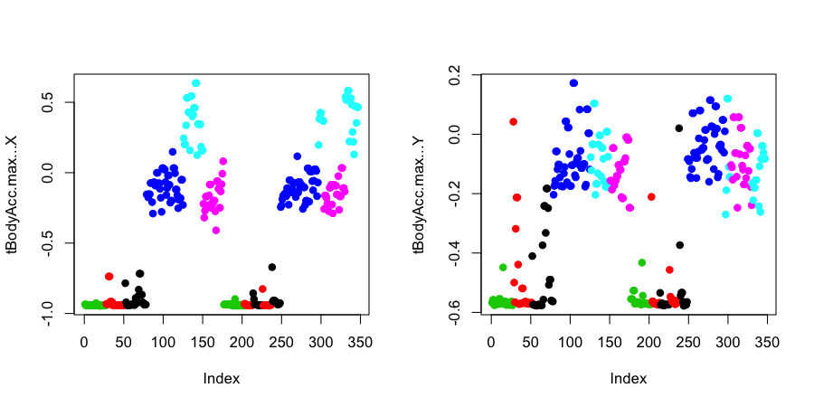

## Pro tip

Learn how to write papers in a very clear and simple style. Whenever you can write in plain english and make the approach you are using understandable and clear. This can (sometimes) make it harder to get your papers into journals. But simple, clear language leads to much higher use/citation of your work. Examples of great writers are: John Storey, Brad Efron, Robert May, Martin Nowak, etc.

---

## Paper(s) of the day

[Winners don't punish](http://www.ped.fas.harvard.edu/people/faculty/publications_nowak/DreberRand_Nature08.pdf)

[On being the right size](http://irl.cs.ucla.edu/papers/right-size.html)


---

## Samsung Galaxy S3


[http://www.samsung.com/global/galaxys3/](http://www.samsung.com/global/galaxys3/)


---

## Samsung Data


[http://archive.ics.uci.edu/ml/datasets/Human+Activity+Recognition+Using+Smartphones](http://archive.ics.uci.edu/ml/datasets/Human+Activity+Recognition+Using+Smartphones)


---

## Slightly processed data

[Samsung data file]("https://dl.dropboxusercontent.com/u/7710864/courseraPublic/samsungData.rda")


```r
load("data/samsungData.rda")
names(samsungData)[1:12]
```

```
 [1] "tBodyAcc-mean()-X" "tBodyAcc-mean()-Y" "tBodyAcc-mean()-Z" "tBodyAcc-std()-X" 
 [5] "tBodyAcc-std()-Y"  "tBodyAcc-std()-Z"  "tBodyAcc-mad()-X"  "tBodyAcc-mad()-Y" 
 [9] "tBodyAcc-mad()-Z"  "tBodyAcc-max()-X"  "tBodyAcc-max()-Y"  "tBodyAcc-max()-Z" 
```

```r
table(samsungData$activity)
```

```

  laying  sitting standing     walk walkdown   walkup 
    1407     1286     1374     1226      986     1073 
```


---

## Plotting average acceleration for first subject


```r
par(mfrow = c(1, 2), mar = c(5, 4, 1, 1))
samsungData <- transform(samsungData, activity = factor(activity))
sub1 <- subset(samsungData, subject == 1)
plot(sub1[, 1], col = sub1$activity, ylab = names(sub1)[1])
plot(sub1[, 2], col = sub1$activity, ylab = names(sub1)[2])
legend("bottomright", legend = unique(sub1$activity), col = unique(sub1$activity), pch = 1)
```

<div class="rimage center"></div>


---

## Clustering based just on average acceleration

<!-- ## source("http://dl.dropbox.com/u/7710864/courseraPublic/myplclust.R")  -->


```r
source("myplclust.R")
distanceMatrix <- dist(sub1[,1:3])
hclustering <- hclust(distanceMatrix)
myplclust(hclustering, lab.col = unclass(sub1$activity))
```

<div class="rimage center"></div>


---

## Plotting max acceleration for the first subject


```r
par(mfrow=c(1,2))
plot(sub1[,10],pch=19,col=sub1$activity,ylab=names(sub1)[10])
plot(sub1[,11],pch=19,col = sub1$activity,ylab=names(sub1)[11])
```

<div class="rimage center"></div>


---

## Clustering based on maximum acceleration


```r
source("myplclust.R")
distanceMatrix <- dist(sub1[,10:12])
hclustering <- hclust(distanceMatrix)
myplclust(hclustering,lab.col=unclass(sub1$activity))
```

<div class="rimage center"></div>


---

## Singular Value Decomposition


```r
svd1 = svd(scale(sub1[, -c(562, 563)]))
par(mfrow = c(1, 2))
plot(svd1$u[, 1], col = sub1$activity, pch = 19)
plot(svd1$u[, 2], col = sub1$activity, pch = 19)
```

<div class="rimage center"></div>


---

## Find maximum contributor


```r
plot(svd1$v[, 2], pch = 19)
```

<div class="rimage center"></div>


---

##  New clustering with maximum contributer


```r
maxContrib <- which.max(svd1$v[, 2])
distanceMatrix <- dist(sub1[, c(10:12, maxContrib)])
hclustering <- hclust(distanceMatrix)
myplclust(hclustering, lab.col = unclass(sub1$activity))
```

<div class="rimage center"></div>


---

##  New clustering with maximum contributer


```r
names(samsungData)[maxContrib]                          
```

```
[1] "fBodyAcc.meanFreq...Z"
```


---

##  K-means clustering (nstart=1, first try)


```r
kClust <- kmeans(sub1[,-c(562,563)],centers=6)
table(kClust$cluster,sub1$activity)
```

```
   
    laying sitting standing walk walkdown walkup
  1      0       0        0    0       26      0
  2      0       0        0    0       23      0
  3      0       0        0   27        0      0
  4     42      45       53    0        0      0
  5      8       2        0    0        0     53
  6      0       0        0   68        0      0
```


---

##  K-means clustering (nstart=1, second try)


```r
kClust <- kmeans(sub1[, -c(562, 563)], centers = 6, nstart = 1)
table(kClust$cluster, sub1$activity)
```

```
   
    laying sitting standing walk walkdown walkup
  1      0       0        0    0        0     53
  2     27       0        0    0        0      0
  3      0      34       50    0        0      0
  4     14      11        3    0        0      0
  5      0       0        0   95       49      0
  6      9       2        0    0        0      0
```


---

##  K-means clustering (nstart=100, first try)


```r
kClust <- kmeans(sub1[,-c(562,563)],centers=6,nstart=100)
table(kClust$cluster,sub1$activity)
```

```
   
    laying sitting standing walk walkdown walkup
  1     18      10        2    0        0      0
  2      0       0        0    0       49      0
  3      0      37       51    0        0      0
  4      0       0        0   95        0      0
  5     29       0        0    0        0      0
  6      3       0        0    0        0     53
```


---

##  K-means clustering (nstart=100, second try)


```r
kClust <- kmeans(sub1[, -c(562, 563)], centers = 6, nstart = 100)
table(kClust$cluster, sub1$activity)
```

```
   
    laying sitting standing walk walkdown walkup
  1      0      37       51    0        0      0
  2      0       0        0    0       49      0
  3     18      10        2    0        0      0
  4     29       0        0    0        0      0
  5      0       0        0   95        0      0
  6      3       0        0    0        0     53
```


---

##  Cluster 1 Variable Centers (Laying)


```r
plot(kClust$center[1, 1:10], pch = 19, ylab = "Cluster Center", xlab = "")
```

<div class="rimage center"></div>


---

##  Cluster 2 Variable Centers (Walking)


```r
plot(kClust$center[4,1:10],pch=19,ylab="Cluster Center",xlab="")
```

<div class="rimage center"></div>

