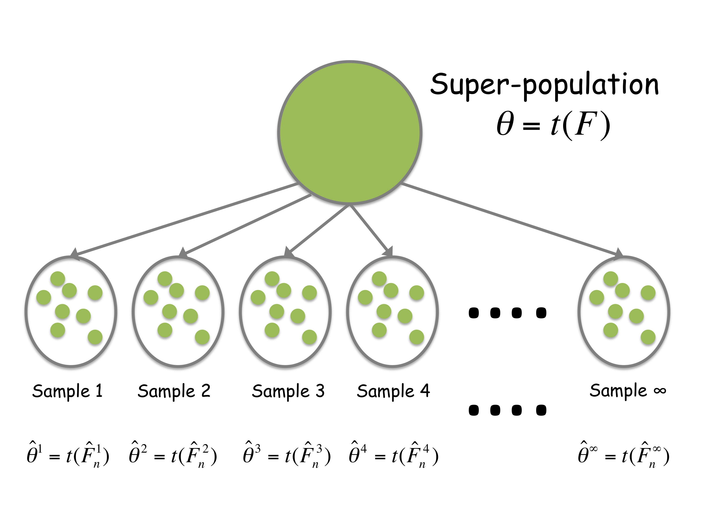
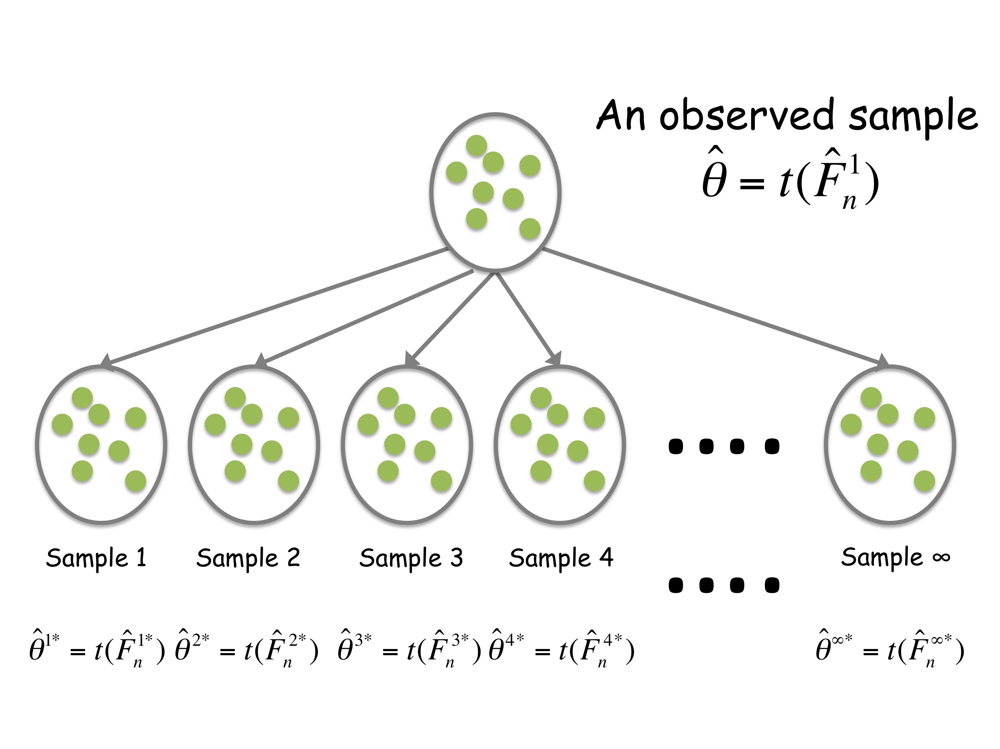

```{r setup, cache = F, echo = F, message = F, warning = F, tidy = F}
# make this an external chunk that can be included in any file
options(width = 100)
opts_chunk$set(message = F, error = F, warning = F, comment = NA, fig.align = 'center', dpi = 100, tidy = F, cache.path = '.cache/', fig.path = 'fig/')

options(xtable.type = 'html')
knit_hooks$set(inline = function(x) {
  if(is.numeric(x)) {
    round(x, getOption('digits'))
  } else {
    paste(as.character(x), collapse = ', ')
  }
})
knit_hooks$set(plot = knitr:::hook_plot_html)
```


## Pro tip

Science is run by humans. Science is also not one thing, but a lot of things. Keeping this in mind can save you a lot of headache. 


---

## Papers of the day

[R Markdown: Integrating A Reproducible Analysis Tool into Introductory Statistics](http://arxiv.org/abs/1402.1894)

[PloS Data Sharing Policy](http://blogs.plos.org/everyone/2014/02/24/plos-new-data-policy-public-access-data/)

* [9 questions about the new PLoS clarification](http://scientopia.org/blogs/neuropolarbear/2014/02/28/9-questions-plos-clarification/)
* [PLoS Clarification confuses me more](http://rxnm.wordpress.com/2014/03/03/plos-clarification-confuses-me-more/)
* [I own my data until I don't](http://smallpondscience.com/2014/03/03/i-own-my-data-until-i-dont/)


---

## The bootstrap - the 30,000 foot view

Bootstrapping is a computational procedure for:

* Calculating standard errors
* Forming confidence intervals
* Performing hypothesis tests
* Improving predictors (called bagging)

---

## A bit of history

The basic idea behind bootstrapping is to treat the sample of data you observe (or some appropriate function of the data) as
if it was the super-population you were sampling from. Then you sample from the observed set of values to try to approximate
the sampling variation in the whole population. 

The idea of the bootstrap was originally proposed by [Efron in 1979](http://projecteuclid.org/DPubS?service=UI&version=1.0&verb=Display&handle=euclid.aos/1176344552) 

Related ideas are very old by the standards of statistics (Quenouille, 1956 Notes on bias in estimation. Tukey, 1958 Bias and confidence in not-quite large samples) 


---

## The Frequentist "Central Dogma"




---

## The Bootstrap "Central Dogma"



---

## The plug in principal and ECDF 

The __plug-in__ principle states that if we have a parameter $\theta = t(F)$, then we estimate the parameter
by applying the same functional to an estimate of the distribution function $\hat{\theta} = t(\hat{F}_n)$. Although
other estimates can also be used\vsp
The default $\hat{F}_n = {\mathbb F}_n$ is the empirical distribution $$ {\mathbb F}_n(y) = \frac{1}{n} \sum_{i=1}^n 1(Y_i \leq y)$$
A sample $Y_i^*$ from ${\mathbb F}_n$ has the property that $Y_i^* = Y_j$ with probability $1/n$ for $1 \leq j \leq n$\vsp
Why ${\mathbb F}_n$?

* Glivenko-Cantelli ($||{\mathbb F}_n-F||_\infty  = \sup_{y\in \mathbb{R}}|{\mathbb F}_n(y) - F(y)| \rightarrow_{a.s.} 0$)
* ${\mathbb F}_n$ is a maximum likelihood estimate (see e.g. http://www.cs.huji.ac.il/~shashua/papers/class3-ML-MaxEnt.pdf)
* It is reasonable 

---

## An example of the plug in principle

Suppose $Y_i > 0$ are _i.i.d._ from $F$. We might be interested in:
$$ \theta = {\rm E}_F \log(Y)$$
- the log of the geometric mean of F. A plug in estimate of $\theta$ is:
$$\hat{\theta} = {\rm E}_{{\mathbb F}_n} \log(Y^*)$$
which is actually available in closed form:
$$\hat{\theta} = \frac{1}{n} \sum_{i=1}^n \log(Y_i)$$
We never specified $F$ parametrically, hence this is a model-agnostic estimate and robustness can be expected, in large samples. (Also note $e^{\hat{\theta}}$ is the sample geometric
mean)

---

## Another example

Let $Y$ be a binary variable and suppose
$$\theta(F) = Pr(Y = 1) = {\rm e}_F[1(Y_i = 1)]$$
We can find the estimate of $\theta(F)$ using the plug-in principle:
$$\hat{\theta} = {\rm e}_{{\mathbb F}_n}[1(Y_i^* = 1)] = \bar{Y}$$
Suppose we wanted an estimate for the variance $${\rm Var}(\hat{\theta}) = {\rm Var}(\bar{Y}) = {\rm Var}(Y_i)/n$$

We could use the plug in estimator
$${\rm Var}_{{\mathbb F}_n}(Y_i)/n = {\rm e}_{{\mathbb F}_n}[(Y_i^* - \bar{Y})^2]/n = \frac{\bar{Y}(1-\bar{Y})}{n}$$


---

## The algebra for ${\rm Var}_{{\mathbb F}_n}(Y_i)$

$${\rm Var}_{{\mathbb F}_n}(Y_i)/n = {\rm E}_{{\mathbb F}_n}[(Y_i^* - \bar{Y})^2]/n$$
$$= \sum_{j=1}^n \frac{1}{n}(Y_j - \bar{Y})^2$$
$$=\frac{1}{n}\left[(1-\bar{Y})^2 \sum_{j=1}^n Y_j + \bar{Y}^2 \sum_{j=1}^n(1- Y_j)\right]$$
$$=\frac{1}{n} \left[\sum_{j=1}^n Y_j - 2\bar{Y} \sum_{j=1}^n Y_j + n\bar{Y}^2\right]$$
$$= \bar{Y}^2 - \bar{Y} = \bar{Y}(1-\bar{Y})$$

When evaluating ${\rm E}_{{\mathbb F}_n}$, $\bar{Y}$ is a ``parameter'' and treated as fixed. 

---

## Bootstrap - usually no closed form

Usually, no closed form evaluation will exist (we sort of "got lucky" in the previous examples). How did we get lucky? The plug-in estimate ended up being an expectation of a single random variable $Y_i^*$.

* What if we were unlucky and the plug in estimate was a function of all of the values $Y_1^{*},\ldots,Y_n^{*}$?

* For example, suppose we wanted to estimate the variance of the sample median $\hat{\theta} = {\mathbb F}_n^{-1}(1/2)$?

* In this case, the variance ${\rm Var}_{{\mathbb F}_n}(\hat{\theta})$ is an expectation of a function of $Y_1^*,\ldots,Y_n^*$.

---

## Too many bootstrap samples

It isn't clear there is a pretty formula for the variance of the median, but if we let $X_j$ denote the number of times $Y_j$ occurs in a bootstrap sample, then: $(X_1,\ldots,X_n) \sim Mult(n; 1/n,\ldots, 1/n)$ so:
$$ \sum_{Y^*\in \mathcal{S}} \left\{{\mathbb F}_n^{*-1}(1/2) - {\rm E}_{{\mathbb F}_n}[{\mathbb F}_n^{-1}(1/2)]\right\}^2 \frac{n!}{\prod_{i=1}^n x_i!} (1/n)^n$$
where ${\mathbb F}_n^{*-1}(1/2)$ is the sample median for each bootstrap sample and $\mathcal{S}$ is the set of all unique
bootstrap samples from $Y_1,\ldots,Y_n$. 

* There are ${2n -1}\choose{n}$ unique bootstrap samples.
* For $n = 10$ there are 92,378 unique values. For $n=25$ there are 63.2 trillion or so. 


---

## Monte carlo bootstrap

Most of the time, you'll use the bootstrap for parameters where a closed form doesn't necessarily exist. 
Instead we use a __Monte Carlo__ approach. 
For the variance of the sample median you would:

* Select $B$ independent bootstrap samples $Y^{*b}$ from ${\mathbb F}_n$. 
* Recalculate the statistic for each sample $\hat{\theta}^{*b} = {\mathbb F}_n^{*b-1}(1/2)$
* Approximate $\sum_{Y^*\in \mathcal{S}} \left\{{\mathbb F}_n^{*-1}(1/2) - {\rm E}_{{\mathbb F}_n}[{\mathbb F}_n^{-1}(1/2)]\right\}^2 \frac{n!}{\prod_{i=1}^n x_i!} (1/n)^n$
by $$\frac{1}{B} \sum_{b=1}^B \left\{{\mathbb F}_n^{*b-1}(1/2) - \bar{{\mathbb F}}_n^{*-1}(1/2)\right\}^2$$ where $\bar{{\mathbb F}}_n^{*-1}(1/2) = \frac{1}{B}\sum_{i=1}^b {\mathbb F}_n^{*b-1}(1/2)$

As $b \rightarrow \infty$ you get closer and closer to the exact or ``ideal bootstrap''. 


---

## Bootstrap - Monte Carlo standard error

The general form for calculating bootstrap standard errors is similar:

* Select $B$ independent bootstrap samples $Y^{*b}$ from ${\mathbb F}_n$. 
* Recalculate the statistic for each sample $\hat{\theta}^{*b}$
* Approximate ${\rm E}_{{\mathbb F}_n}[(\hat{\theta*} - \hat{\theta})^2]$
by $$\frac{1}{B} \sum_{b=1}^B (\hat{\theta}^{*b} - \bar{\hat{\theta}}^{*})$$
where $\bar{\hat{\theta}}^* = \frac{1}{B}\sum_{i=1}^b \hat{\theta}^{*b}$


--- 

## Bootstrap - Monte Carlo coverage estimates

For a confidence interval $a(Y), b(Y)$ based on a sample of size n, we may want to estimate coverage $$E_F 1_{[a < \theta < b]} = Pr(a < \theta < b | F)$$. The bootstrap estimate is
$$E_{{\mathbb F}_n} 1_{[a < \hat{\theta} < b]} = Pr(a < \hat{\theta} < b | {\mathbb F}_n)$$
The Monte-Carlo version of this calculation is: 

* Select $B$ independent bootstrap samples $Y^{*b}$ from ${\mathbb F}_n$
* Approximate the coverage by:
$$ \hat{{\rm Coverage}}_{BOOT} = \frac{1}{B} \sum_{b=1}^B 1_{[\ell(Y^{*b}) < \hat{\theta} < u(Y^{*b})]}$$


Note this means you need two steps of calculation
