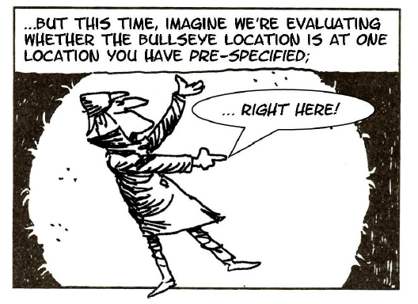
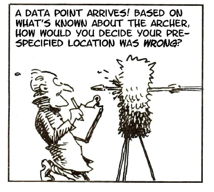
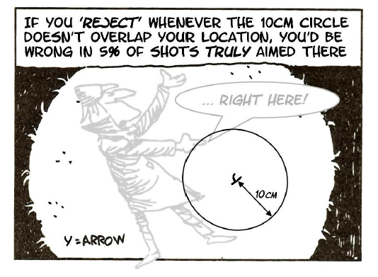
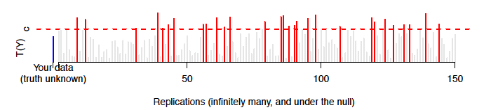
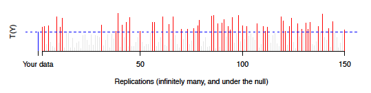
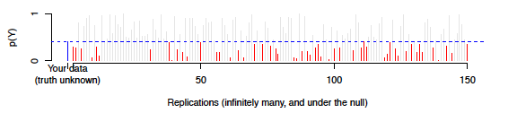
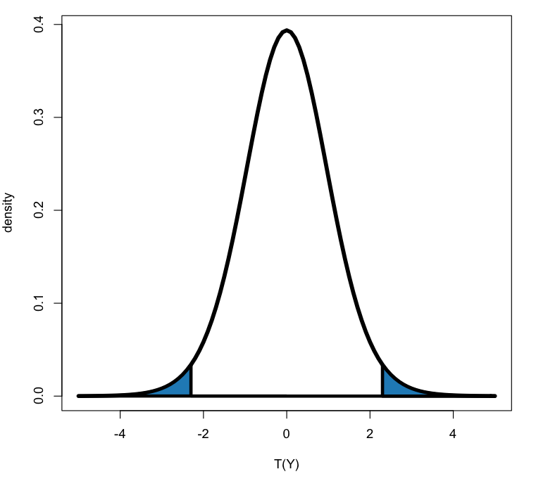
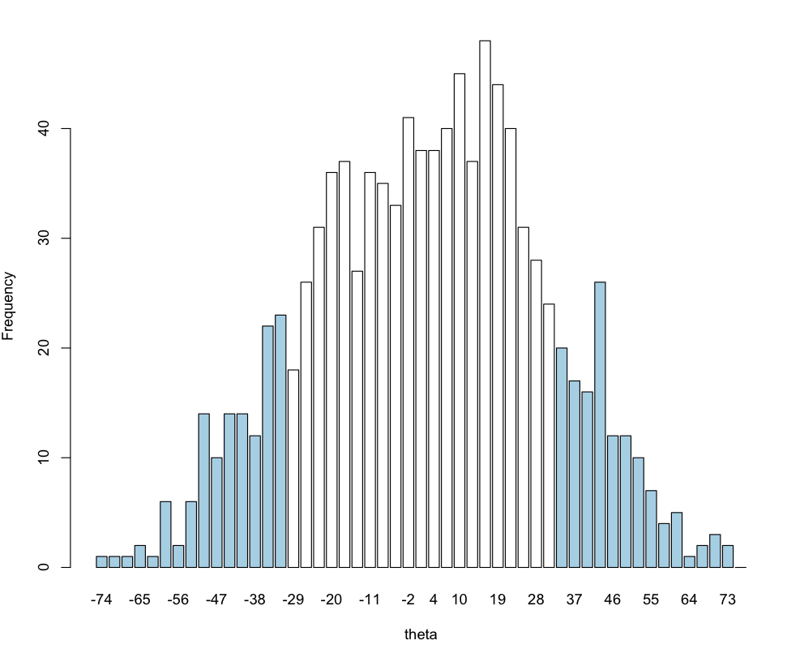
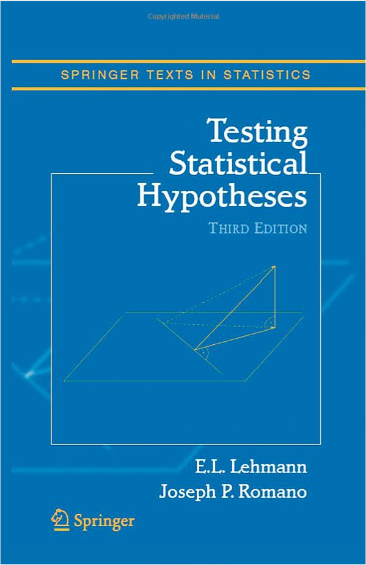

## Pro tip

Be a finisher. The key to getting a Ph.D. (or do anything important) is the ability to sit down and just power through and get it done. This means sometimes you will have to work late or on a weekend. The people who are the most successful in grad school are the people that just find a way to get it done. If it was easy...anyone would do it. 

__Related tip__: Be aware of overwork. Academics right now is a job that can eat you up if you aren't careful. People who claim academics are lazy, or should just be happy because they are "doing what they love" are ignorant and should be ignored. [Your 60 hour workweek is not a badge of honor](http://jeffarchibald.ca/60-hour-work-week-badge-honour/)

---

## Paper of the day

[Confidence limits on phylogenies: An approach using the bootstrap](http://statweb.stanford.edu/~nzhang/Stat366/Felsenstein85.pdf)

---

## Testing background

* In many scientific applications, producing/interpreting estimates and intervals will be your default. But hypothesis testing (for better or worse) plays a major role in the scientific enterprise.
* There is a huge literature bashing P-values and hypothesis tests. Search "NHST" on Google or read anything by Jim Berger, Andrew Gelman, Steve Goodman, etc. etc. 
* I personally think the problem is that people don't understand (or willfully misinterpret) the P-value.
* Doing tests is simple; based on the available data, we make a binary decision. Frequentist calibration of the testing "rule" considers replications of the experiment.
* Interpretation of testing results is trickier. You may need to
be flexible about how testing is viewedit may change as you
work in different areas of science. 
* Different statisticians lend more or less credibility to p-values/testing (although they are used extensively by e.g. lab scientists, the FDA, etc.)
* We will discuss permutation/bootstrap hypothesis tests today. However, similar ideas
apply to parametric testing. 

---

## P-values: most popular statistic ever

* If properly credited R.A. Fisher would have at least 3 million citations for p-value paper
* Calculated using Google Scholar using the formula: __Number of P-value Citations = # of papers with exact phrase "P < 0.05" + (# of papers with exact phrase "P < 0.01" and not exact phrase "P < 0.05"") +  (# of papers with exact phrase "P < 0.001" and not exact phrase 
"P < 0.05" or "P < 0.01")= 1,320,000 + 1,030,000 + 662,500__
* This is probably even conservative and is at least 12 times the most cited paper [Protein Measurement with the Folin Phenol Reagent](http://www.jbc.org/content/280/28/e25.full#)
* Related idea: if you do something important expect major criticism/ripoffs.
* Related: [Scalability of statistical procedures](http://simplystatistics.org/2014/02/14/on-the-scalability-of-statistical-procedures-why-the-p-value-bashers-just-dont-get-it/)

---

## Archers

---

## Archers

---

## Archers

---

## Archers

---

## Implementing a test

* To implement testing, we choose a __test statistic__ $T(X,Y)$. We use it to make
a binary decision D, where convention is that:
$$ D = \left\{\begin{array}{ccc}0, & T(X,Y) \leq c & {\rm ``not \; significant''}\\ 1, & T(X,Y) > c & {\rm ``significant''} \end{array}\right.$$
for some pre-chosen "critical value" $c$. Calibration of the test (ie. choosing $c$) is done under the null hypothesis $H_0$ a statement about the true state of Nature. 

* Typical null hypotheses are $H_0: \theta = 0$ or perhaps $H_0: \theta < 0$ - in fact any well-defined statement about the superpopulation could be used. We will focus on $H_0$ with some regression-based meaning. 
* I will write $F|H_0$ to denote sampling from a superpopulation where the null holds, in expressions such as ${\rm E}_{F|H_0}[D]$. This is known as sampling ``under the null''

---

## Frequentist calibration

The "size" or "Type I error rate"" of a test is defined as:
$${\rm E}_{F|H_0}[D] = Pr_{F|H_0}[D=1]$$
i.e. the probability of getting $D=1$ under the null.

In practice, we choose $c$ to give a desired size, then do the test. The target Type I error rate is denoted $\alpha$. Results with $D=1$ are "significant at the $\alpha$ level". 

We say tests are "valid at the nominal $\alpha$" if ${\rm E}_{F|H_0}[D] \leq \alpha$ and "exact" if ${\rm E}_{F|H_0}[D] = \alpha$..., but some authors reverse these terms. Tests with ${\rm E}_{F|H_0}[D] \leq \alpha$ "control the Type I error rate below $\alpha$"

---

## Tests and intervals

Suppose you had a valid confidence interval "recipe" $CI(Y,X)$ for parameter $\theta$, to be used in replicate experiments. A simple binary decision for testing $H_0:  \theta = \theta_0$ is the indicator function $D=1_{\{\theta_0 \notin CI\}}$. As $Pr_{F}[\theta \in CI]  = 1-\alpha$

$$Pr_{F}[\theta \notin CI] = \alpha$$
$$\Rightarrow Pr_{F|\theta = \theta_0}[1_{\{\theta_0 \notin CI\}} = 1] = \alpha$$
$$\Rightarrow {\rm E}_{F|\theta=\theta_0}[D] = \alpha$$
.. and we have a test of size $\alpha$. 

* On its own, this result does not imply sanity! What's the size, for a CI which covers $\mathbb{R}$ with probability $0.95$, and returns the value of 42 with probability 0.05? 
* Of course, sane estimates/intervals give sane tests
* You can do the reverse as well converting tests into CI's

---

## P-values

P-values, although not essential for doing tests, are nearly ubiquitous in applied work. They are a very useful "shorthand" and you should understand them.

Under the convention that larger test statistics occur farther from $H_0$, for observed data $Y$ we  define:
$$p = p(Y) = Pr_{Y'\sim F|H_0}[T(Y') > T(Y)]$$
i.e. the long-run proportion of datasets, under the null, which are "more extreme" than the observed $Y$.

---

## Notes on p-values

* If $p < \alpha$, the result is "significant" otherwise it is "not significant" $p$ is the "largest $\alpha$ at which the result would be significant" - i.e. it summarizes the tests you could do. 
* If $p$ is small, you could say the data are "inconsistent" with $H_0$ (not the same as an inconsistent estimator). Avoid writing about "evidence" or "support", unless these terms express what you really mean. Writing that the data "suggest" conclusions is safe(r). 
* Small $p$ occur
  1. when $H_0$ is true and something unusual happened, 
  2. when $H_0$ is not true.  
* On its own, a small $p$ does not distinguish these two things
*  For discrete $Y$, $T(Y) = T(Y')$ can happen, discreteness of $p$ is only interesting in small samples, and is often ignored

---

## Distribution of P-values

What's the distribution of a $p$-value? Under the null:

$$Pr_{Y \sim F|H_0}[p(Y) < \alpha] = Pr_{Y \sim F|H_0}\left[Pr_{Y' \sim F|H_0}[T(Y') > T(Y)] \leq \alpha \right]$$
$$= Pr{Y \sim F|H_0}[ 1 - \mathcal{F}(T(Y)) \leq \alpha]$$
$$= Pr{Y \sim F|H_0}[T(Y) > \mathcal{F}^{-1}(1-\alpha)]$$
$$= 1 - \mathcal{F}(\mathcal{F}^{-1}(1-\alpha)) = \alpha$$

where $\mathcal{F}(\cdot)$ denotes the cumulative distribution function of $T(Y)$ under the null. 

---

## Important properties of p-values

* $p$-values are uniform on $[0,1]$ under the null 
* $p$-values are given by the "tail area" of the distribution of (replicate) $T(Y')$ beyond observed $T(Y)$ under the null
*  $p$-values are (complicated) functions of the observed data
* Just as with intervals, if your assumptions about $F$ are wrong, your putative $p$-values
will not have "nominal" behavior. As with intervals, approximations are widely used. 

---

## P-values as functions

People often forget $p$-values are just functions of the data. Formally, the $p$ value is a 1-1 function of $T(Y)$

We usually focus on how the lower quantiles of $p(Y)$ depends on $\theta$ - but the spread can also be useful to know. 

---

## P-values, useful but not the whole story

The simplicity of calculating $p(Y)$, seeing if its $< 0.05$ and reporting on the underlying "truth" means that many non-experts think that inference is entirely $p$'s and $t$'s

You know this isn't true. P-values can be a useful summary of the data, with nice properties (particularly useful in applications where confidence intervals may be unwieldy).

But...at the end of the day as sane applied statisticians you are looking for sensible/scientifically meaningful patterns, which are often more usefully summarized by confidence intervals and point estimates.

---

## Testing: different decisions

Frequentist tests report $D=1$ whenever $p \leq \alpha$. You should report $p$, so your reader can pick their own $\alpha$. 

But what $\alpha$? And what does "significant" mean practically? Testing output may be used for different goals. We may want:

* A summary of whether the data is consistent with a particular hypothesis (a pure significance test - just calculate $p$)
* A decision (yes/no) whether the data is consistent with a particular hypothesis (a test of significance  - if $p < \alpha$ we reject $H_0$)
* A decision (yes/no) on which of two hypotheses is best supported by the data (a hypothesis test - if $p < \alpha$ we reject $H_0$ in favor of $H_1$, else ``accept'' $H_0$. $H_1$ is the alternative hypothesis. )

These goals are all different!

---

## Significance tests

For either type of "significance" test

* There is no alternative hypothesis. Informally, you can view these as a screening tool indicating how noteworthy the data is, or whether (yes/no) we declare it interesting
*  You must choose $T(\cdot)$ to detect deviations from $H_0$ which are of interest!
* Power = $Pr_F[D=1]$, the probability of rejecting when $H_0$ does not hold. In regression settings, this is a function of the true $\theta$ and $n$. 
* Power = $1-Pr_F[D=0]$ i.e. 1-the probability of a Type II error. 
* Think about power before doing tests! In a lower power setting, if $D=0$ what two things __may__ have happened? When $n$ is huge and $D=1$ what may have happened? 
* Unthinking adherence to $p$ is not good statistics/science. Don't expect readers to "reject the null" without convincing science (the more money on the line, the more this is true). 

---

## Hypothesis tests

* There has to be an alternative hypothesis, $H_1$. You should choose $T(\cdot)$ based on this alternative
* The test is calibrated under $H_0$, not $H_1$. it is not an "evan handed" comparison. $H_0$ represents a "default" outcome. 
* Power matters, and real-world interpretations should use your prior knowledge
* In e.g. drug licensing, getting $p < \alpha$ (twice!) is necessary but not sufficient for a "yes" decision, even with well-powered studies. Some scientific justification is again required; $p$ alone will not convince competent reviewers. 

---

## Testing: different decisions

* You work with a mouse lab. They did an experiment to assess whether a specific "candidate" gene is essential to life.
* A consulting client comes to you with a totally novel chemical process. They have some (unanalyzed) provisional data, and want to know whether to proceed with more experiments. 
* Prior to analysis of a new risk factor, your co-authors want to check if age, sex, etc. are unusual in your sample (this is known as a "Table 1" analysis in some circles)
* A consulting client provides you with a complex dataset and wants to know "what's interesting"?
* In a large trial, you obtain data consistent with a new drug being moderately effective (not strongly, not weakly). You are asked, "is it significant"?

---

## What p-values are not

There is a tremendous confusion over $p$-values. The following hold very generally

* They do not represent $Pr(H_0 {\rm is \; true})$ or $Pr(\theta > 0)$. Statements like this don't even make sense in a frequentist setting - so avoid writing them or something that could be interpreted this way. 
*  The are not "measures of evidence". They are a summary of the testing decision you could make, a and a potentially useful function of the data. "Evidence" is a loaded word to some statisticians!
* $p \leq 0.05$ is not "proof" of anything. 
* $p \neq 0$ (Why?) - don't round $p$ values down. You can write, e.g. $p < 10^{-4}$

---

## Calculating a p-value (parametric)

Suppose we calculate a statistic $T(Y)$ to test the null hypothesis $H_0: \theta = 0$ and we know that under the null $T(Y') \sim t_{19}$. How do we calculate the p-value? 

This calculation presumes we know the distribution $t_{19}$, what if we want to make fewer assumptions about the null distribution? 

---

## Calculating a p-value (permutation)

Suppose we observe survival times on 16 mice in a treatment and a control group: 
$$X = (94, 197, 16, 38, 99, 141, 23)$$ 
$$Y = (52, 104, 146, 10, 51, 30, 40, 27, 46)$$ 
$X \sim F$ and the values $Y \sim G$ and we want to test: $H_0: F = G$. \vsp
The difference of means is $\hat{\theta} = \bar{x} - \bar{y} = 30.63$. One way to calculate a p-value would be to make a parametric assumption. \vsp 

Another clever way, devised by Fisher is __permutation__. Define the vector $g$ to be the group labels $g_i = 1$ if treatment (X) and $g_i = 0$ if control (Y). Then pool all of the observations together into a vector $v = (94, 197, 16, 38, 99, 141, 23, 52, 104, 146, 10, 51, 30, 40, 27, 46)$

---

## P-value permutations

If there are $n$ samples from $F$ and $m$ samples from $y$ for a total of $N = m + n$ samples, then there are ${N}\choose{n}$ possible ways to assign the group labels. 

Under $F = G$ it is possible to show that - conditional on the observed values - each of these is equally likely. So we can write our statistic $$\hat{\theta} = \bar{x} - \bar{y} = \frac{1}{n} \sum_{g_i = 1} v_i - \frac{1}{m}\sum_{g_i=0} v_i$$

The permutation null distribution of $\hat{\theta}$ is calculated by forming all permutations of $g$ and recalculating the statistic: 

$$\hat{\theta}^' = \frac{1}{n} \sum_{g^'_i = 1} v_i - \frac{1}{m}\sum_{g^'_i=0} v_i$$

---

## P-value permutations

* Then a permutation p-value is the permutation probability that $|\hat{\theta}^'|$ exceeds $|\hat{\theta}|$. $Pr(\hat{\theta}^'  \geq \hat{\theta})  = \#\{|\hat{\theta}^'| \geq |\hat{\theta}| \} / {{N}\choose{n}}$. \vsp
* This is an _exact_ calculation, just like we did before with the exact plug-in estimator. But usually ${N}\choose{n}$ is humongous, so we use Monte Carlo.

* Sample the labels $g_i$ _with replacement_ to get $B$ permuted sets of group labels $g_i^{'b}$
* Evaluate the permutation statistics $\hat{\theta}^{'b} = \frac{1}{n} \sum_{g^{'b}_i = 1} v_i - \frac{1}{m}\sum_{g^{'b}_i=0} v_i$
* Calculate the permutation p-value:
$$\hat{p}_{perm} =  \#\{|\hat{\theta}^{'b}| \geq |\hat{\theta}| \} /B$$

---

## Tail area again

---

## P-value Bootstrap

* Draw $B$ samples with replacement of size $n + m$ from the values $v = [ x ; y]$. Call the first $n$ observations $x{'b}$ and the last $m$ observations $y{'b}$. 
*  Evaluate $\hat{\theta}^{'b}  = \bar{x}^{'b} - \bar{y}^{'b}$ on each sample. 
* Approximate the $p$-value by:
$$\hat{p}_{boot} = \#\{|\hat{\theta}^{'b}| \geq |\hat{\theta}| \} /B$$

* Note this is very similar to the permutation based approach. We just sample with replacement. 

---

## A note on studentizing 

* We could studentize the statistic
$$\hat{\theta} = \frac{\bar{x} - \bar{y}}{\bar{\sigma} \sqrt{1/n + 1/m}}$$

* In the case of the permutation test we would get the same permutation p-value.
* For the bootstrap this doesn't hold (why?)
* You get more accurate testing with the studentized statistic. 

---

## Flexibility of bootstrap for p-values

This algorithm still tests the null hypothesis that $F = G$. What if we wanted to be more specific? Say if we wanted to test that $\mu_F = \mu_G$?

We could use this algorithm: 

* Let $\hat{F}$ put equal probability on the points $\tilde{x}_i = x_i - \bar{x} + \bar{v}$ $i=1,2,\ldots,n$ and $\hat{G}$ put equal probability on the points $\tilde{y}_i = y_i - \bar{y} + \bar{v}$ $i = 1,2,\ldots,m$, where $\bar{x}$ and $\bar{y}$ are the group means and $\bar{v}$ is the mean of the combined sample. 

* Form $B$ bootstrap data sets $(x^{'b},y^{'b})$ where $x^{'b}$ is sampled with replacement from $\{\tilde{x}_i\}$ and $y^{'b}$ is sampled with replacement from $\{\tilde{y}_i\}$. 

* Evaluate $T = \frac{\bar{x}^{'b} - \bar{y}^{'b}}{\sqrt{\bar{\sigma}_1^{2'b} + \bar{\sigma}_2^{2'b}}}$

* Approximate the $p$-value by:
$$\hat{p}_{boot} = \#\{|\hat{\theta}^{'b}| \geq |\hat{\theta}| \} /B$$

---

## When using bootstrap for significance/hypothesis testing

* The goal is to "mimic the null"
* This can be complicated and takes some thinking
* If you come up with an algorithm it is worth testing on obvious simulated data
* The most flexible approach for doing hypothesis testing currently available

---

## Bootstrap versus permutation

* A permutation test exploits a special symmetry that exists under the null hypothesis to create a permutation distribution. 
* The permutation test is exact, it is the exact probability of obtaining a test statistic as extreme, having fixed the values of the combined sample. 
* In contrast, the bootstrap estimates the probability mechanism under the null hypothesis, and then samples from it. 
*  The estimate is not an exact probability, but does not require the special symmetry, so can be applied much more generally. 
* For instance, in the two-sample problem a permutation test can only test the null hypothesis $F = G$, while the bootstrap can test equal means with possibly unequal variances. 

---

## Bootstrap hypothesis tests for linear models

Suppose we assume a mean model of the form: 
$${\rm E}[Y_i | X_i =x_i, Z_i=z_i ] = \beta_0 + \underbrace{\sum_{j=1}^J \beta_j x_{ij}}_{{\rm covariates \; of \; interest}} + \underbrace{\sum_{k=1}^K \gamma_k z_{ik}}_{{\rm adjustment \; covariates}}$$
using least squares. Suppose we wish to test the null hypothesis that $\beta_1 = \beta_2 = \cdots = \beta_J = 0$. 

---

## Bootstrap hypothesis tests for linear model

One approach would be to form the F-like-statistic: 
$$ F = \frac{RSS^{0} - RSS}{RSS}$$
Where:
$$RSS_{0} = \sum_{i=1}^n \left(y_i - \hat{\beta}_{0}^{0} - \sum_{k=1}^K \hat{\gamma}^0_k z_{ik}\right)^2$$
$$RSS = \sum_{i=1}^n \left(y_i - \hat{\beta}_{0}- \sum_{j=1}^J \hat{\beta}_j x_{ij} - \sum_{k=1}^K \hat{\gamma}_k z_{ik}\right)^2$$

---

## Estimated coefficients

Here $\beta_0^0$ and $\gamma_k^0$ are obtained when fitting the null model: 
$${\rm E}[Y_i | X_i =x_i, Z_i=z_i ] = \beta_0 + \underbrace{\sum_{k=1}^K \gamma_k z_{ik}}_{{\rm adjustment \; covariates}}$$

---

## Significance test for linear model

Then an algorithm for testing the significance of $F$ could be the following

* Calculate the residuals from the full model $\epsilon_i = y_i -\hat{\beta}_{0}- \sum_{j=1}^J \hat{\beta}_j x_{ij} - \sum_{k=1}^K \hat{\gamma}_k z_{ik}$
* Calculate the fitted values under the null $\hat{y}_i^0 =  \hat{\beta}_{0}^{0} + \sum_{k=1}^K \hat{\gamma}^0_k z_{ik}$
* Sample $B$ times with replacement from $\epsilon_i$ and add the values back to the null fit to generate null data: $y_i^{'b} = \hat{y}_i^0 + \epsilon_i^{'b}$
* Recalculate the statistic $F^{'b}$ on all bootstrap samples
* Approximate the $p$-value by:
$$\hat{p}_{boot} = \#\{|\hat{\theta}^{'b}| \geq |\hat{\theta}| \} /B$$

---

## Notes on bootstrapping linear models

* These tests are common in some areas (like genomics) where the null distribution is frequently not clearly known. 
* They still make assumptions (e.g., the data are i.i.d. $F$)
* The big problem here is creating $Y^'$ that are sampled under the null hypothesis. The standard bootstrap doesn't do this, it samples under the __truth__ approximately. 
* The $\alpha$-level accuracy of these procedures is not exact (upsets e.g. the FDA)
* Also "fiddling"" with $\tilde{F}$ requires choices, try not to be influenced by ``peeking'' at the data. The FDA will not let you do this; they demand code in advance.
* There are now permutation based approaches to the same problem: [COVARIATE-ADJUSTED NONPARAMETRIC ANALYSIS OF MAGNETIC RESONANCE IMAGES USING MARKOV CHAIN MONTE CARLO](http://www.bepress.com/jhubiostat/paper187/)

---

## For more information 

[http://www.amazon.com/Testing-Statistical-Hypotheses-Springer-Statistics/dp/0387988645](http://www.amazon.com/Testing-Statistical-Hypotheses-Springer-Statistics/dp/0387988645)

---

## One of the hottest areas of debate

Fisher (JASA, 1943): "It is not my purpose to make Dr. Berkson
seem ridiculous, nor, of course, to prevent him from providing innocent
amusement. Had he looked up Hersh’s original paper he would have
been spared a blunder,..."

Berkson (Biometrics, 1954): "I consented to comment on the
remarks of Sir Ronald Fisher only with considerable reluctance. The
passages of his article that have to do with my work are so far out
of the bounds of reasonableness or relevancey that on first reading
them I could only believe that he had heen misinformed regarding my
statement"

http://people.stat.sfu.ca/~lockhart/richard/Talks/UBC_SFU.pdf

---

## One of the hottest areas of debate

Fisher (Biometrics,1954): "It is a great pity that Cochran in this
paper does not clearly point out that such adjustments have no useful
function, at least finally, if it is intended to perform a correct analysis.
The subsequent papers (5, 6) by Bartlett (1947) and Anscombe
(1948)) show no such consciousness of the situation as they would
have obtained had Cochran expressed himself more definitely."

"It is unfortunate that Bartlett did not restate his own views on
this topic without making misleading allusions to mine."

Fisher (JRSS-B, 1957): "If Professor Neyman were in the habit of
learning from others he might profit from..."

---

## One of the hottest areas of debate

Neyman (1951) "In particular, three major concepts were
introduced by Fisher and consistently propagandized by him in a
number of publications. These are mathematical likelihood as
a measure of the confidence in a hypothesis, sufficient statistics,
and fiducial probability. Unfortunately, in conceptual mathematical
statistics Fisher was much less successful than in manipulatory, and
of the three above concepts only one, that of a sufficient statistic,
continues to be of substantial interest. The other two proved to be
either futile or self-contradictory and have been more or less generally
abandoned."

---

## One of the hottest areas of debate

Pearson in another review: "Most readers will regret the inclusion of the Note on Paper
(29,1937) which, if nothing more, shows in its last sentences, a
profound ignorance of Karl Pearson’s character and, indeed, of his
contemporaries."

---

## More recently

Ioannidis: "A reproducibility check of the raw data shows that much of the data Jager and Leek used are either wrong or make no sense: most of the usable data were missed by their script, 94% of the abstracts that reported ≥2 P-values had high correlation/overlap between reported outcomes, and only a minority of P-values corresponded to relevant primary outcomes. The Jager and Leek paper exemplifies the dreadful combination of using automated scripts with wrong methods and unreliable data. Sadly, this combination is common in the medical literature." 

Gelman and O'Rourke: "We think what Jager and Leek are trying to do is hopeless, at least if applied outside a very narrow range of randomized clinical trials with prechosen endpoints"

Talking about our paper [An estimate of the science-wise false discovery rate and application to the top medical literature](http://biostatistics.oxfordjournals.org/content/15/1/1)
