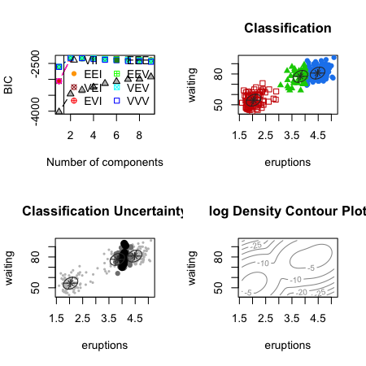

## Pro tip

Academia is a weird place. The main criteria you are evaluated on is research. Everything we learn about in this class is focused on that. But in reality you spend a huge amount of time doing the following:

* Meetings
* Giving talks
* Advising students
* Teaching
* Reviewing (grants, papers, etc.)
* Interacting with collaobrators 

These skills are often secondary in graduate programs but become hugely important very quickly when you become a faculty member. Learning how to do them well early is a fast way to make the transition to faculty dramatically easier. 

---

## Papers of the day


[Bagging predictors](http://statistics.berkeley.edu/sites/default/files/tech-reports/421.pdf)

[A short introduction to boosting](http://cseweb.ucsd.edu/~yfreund/papers/IntroToBoosting.pdf)


---

## New pro tip

The absolute best way to have maximum impact:

1. Find a scientific problem that hasn't been solved with data (by far hardest part)
2. Collect data/partner up with someone with data for that problem. 
3. Create a good solution to the problem 
4. Only invent new methods if you must
5. Write software and document the hell out of it
6. Respond to users and update as needed
7. Don't get (meanly) competitive

---

## New paper of the day

[Does researching casual marijuana use cause brain abnormalities?](http://liorpachter.wordpress.com/2014/04/17/does-researching-casual-marijuana-use-cause-brain-abnormalities/)


---

## An example of least parametric to most

<center> KNN -> Logistic Regression -> LDA -> Fully Bayesian model </center>

* K nearest neighbors
* Logistic regression
* Linear discriminant analysis
* Fully Bayesian model

---

## KNN neighbors 


Basic idea

$$\hat{Y}(x) = \frac{1}{k}\sum_{x_i \in N_k(x)} y_i$$

$$\hat{f}(x) = {\rm Ave}(y_i | x_i \in N_k(x))$$


http://statweb.stanford.edu/~tibs/ElemStatLearn/

---

## 1 nearest neighbor


http://statweb.stanford.edu/~tibs/ElemStatLearn/

---

## KNN for binary problem

$$\hat{Pr}(Y=k) = {\rm Ave}(1(y_i == k) | x_i \in N_k(x))$$


* Advantages
  * Fully non-parametric
  * Flexible
* Disadvantages
  * Prone to overfitting
  * Curse of dimensionality

---

## Logistic regression

<center> Assume a model for $Pr(Y=k | X=x)$ </center>

$$ \rm{logit}Pr(Y = k |X = x) == x\beta$$

* Advantages
  * Still doesn't assume model for $x$
  * Can be more easily explained
* Disadvantages
  * Lose flexibility
  * Accuracy decreases when linear assumption isn't true
  

---

## Linear discriminant analysis


<center> Build parametric model for conditional distribution $P(Y = k | X = x)$ </center>

$$Pr(Y = k | X=x) = \frac{f_k(x) \pi_k}{\sum_{\ell = 1}^K f_{\ell}(x) \pi_{\ell}}$$
  
* Classify to class with highest estimated probability
* Linear discriminant analysis assumes $f_k(x)$ is multivariate Gaussian with same covariances
* Quadratic discrimant analysis assumes $f_k(x)$ is multivariate Gaussian with different covariances
* You can assume more complicated distributions to get more complicated boundaries
* Naive Bayes would be assuming independence between features 

http://statweb.stanford.edu/~tibs/ElemStatLearn/

---

## Why "linear" discriminant analysis?

$$log \frac{Pr(Y = k | X=x)}{Pr(Y = j | X=x)}$$
$$ = log \frac{f_k(x)}{f_j(x)} + log \frac{\pi_k}{\pi_j}$$
$$ = log \frac{\pi_k}{\pi_j} - \frac{1}{2}(\mu_k + \mu_j)^T \Sigma^{-1}(\mu_k + \mu_j)$$
$$ + x^T \Sigma^{-1} (\mu_k - \mu_j)$$

---

## Decision boundaries


http://statweb.stanford.edu/~tibs/ElemStatLearn/

---

## Discriminant function

$$\delta_k(x) = x^T \Sigma^{-1} \mu_k - \frac{1}{2}\mu_k \Sigma^{-1}\mu_k + log(\mu_k)$$


* Decide on class based on $\hat{Y}(x) = argmax_k \delta_k(x)$
* We usually estimate parameters with maximum likelihood

---

## Logistic regression versus LDA

$$log \frac{Pr(Y = k | X=x)}{Pr(Y = j | X=x)}$$
$$ = log \frac{\pi_k}{\pi_j} - \frac{1}{2}(\mu_k + \mu_j)^T \Sigma^{-1}(\mu_k + \mu_j)$$
$$ + x^T \Sigma^{-1} (\mu_k - \mu_j)$$
$$ = \alpha_{k0} + \alpha_k^Tx$$

Similarly from logistic regression


$$log \frac{Pr(Y = k | X=x)}{Pr(Y = j | X=x)} = \beta_{k0} + \beta_k^Tx$$

Both have same form for second term in this equation, but LDA assumes form for first term as well

$$Pr(X,Y=k) = Pr(X)Pr(Y=k|X)$$

http://statweb.stanford.edu/~tibs/ElemStatLearn/

---

## Model based prediction approach

* Assume that prior probability for a cluster is $\pi_k$
* Assume multivariate density for $f(x | Y=k)$, usually normal
* Build a general model for $\Sigma_k$ the conditional covariance
* Estimate the model with the EM approach


---

## Choices for covariance


---

## Bayes factors

$$B_{12} = \frac{Pr(X|M_1)}{Pr(X|M_2)}$$

where

$$Pr(X | M_k) = \int Pr(X | \theta_k M_k)Pr(\theta_k | M_k)d\theta_k$$

* Variables are then selected based on which model is "best" by this metric

---

## mclust package in R is where this is done


```r
library(mclust); data(faithful)
plot(faithful)
```

<div class="rimage center"></div>


http://www.stat.washington.edu/mclust/


---

## mclust package in R is where this is done


```r
faithfulMclust <- Mclust(faithful)
summary(faithfulMclust)
```

```
----------------------------------------------------
Gaussian finite mixture model fitted by EM algorithm 
----------------------------------------------------

Mclust EEE (elliposidal, equal volume, shape and orientation) model with 3 components:

 log.likelihood   n df   BIC   ICL
          -1126 272 11 -2314 -2361

Clustering table:
  1   2   3 
130  97  45 
```


http://www.stat.washington.edu/mclust/


---

## mclust package in R is where this is done


```r
par(mfrow=c(2,2))
plot(faithfulMclust)
```

<div class="rimage center"></div>


http://www.stat.washington.edu/mclust/


---

## Model based clustering advantages and disadvantages

* Advantages
  * Fully parametric so can compute all posterior quantities
  * Can be a little more interpretable
* Disadvantages
  * Much less flexible
  * If your assumptions are wrong can be pretty far off

---

## Bagging proof

Let $\phi(x,D_{train})$ be the predictor based on a training set $D_{train}$ then we could create a bagged predictor:

$$\phi_A(x,P) = E_{D}[\phi(x,D)]$$

where $P$ is the probability distribution over $D$. Then:

$$e = E_D E_{Y,X}(Y-\phi(X,D))^2$$

aggregated error is:

$$e_A = E_{Y,X}(Y-\phi_A(X,D))^2$$

Using the inequality $(EZ)^2 \leq EZ^2$

$$e = EY^2 - 2EY\phi_A + E_{Y,X}E_D \phi^2(X,D$$
$$ \geq E(Y-\phi_A)^2 = e_A$$

http://statistics.berkeley.edu/sites/default/files/tech-reports/421.pdf

