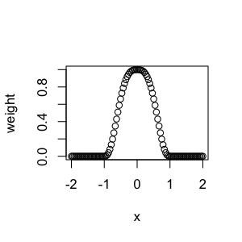
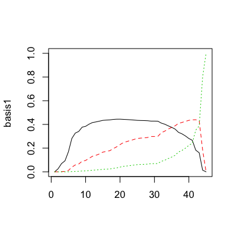
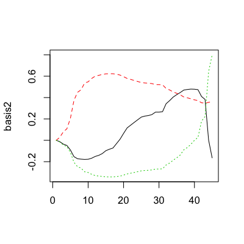

## Pro tip

Set up a feed reader like Feedly. Add a bunch of blogs and journals. At minumum these journals:

* Biostatistics
* AOAS 
* Biometrics

You can add others as you see fit for your area. For example, like

* Bioinformatics
* Genome Biology
* Genome Research

---

## Paper of the day

[Generalized additive models](http://www.stanford.edu/~hastie/Papers/gam.pdf)


---

## Today's slide credits


http://www.biostat.jhsph.edu/~ririzarr/Teaching/754/

---

## Local regression 

$$Y_i = f(x_i) + \varepsilon_i$$

* $f(x)$ is an unknown function and $\varepsilon_i$ is an error term,
representing random errors in the observations or variability from
sources not included in the $x_i$.
* We assume the errors $\varepsilon_i$ are IID with mean 0 and finite
variance $Var(\varepsilon_i) = \sigma^2$. 


---

## Fitting local polynomials

__Plan__: Fit polynomials in local regions. 

__Motivation__: Taylor's theorem

$$f(x) = f(x_0) +  \sum_{k=1}^{K} \frac{f^{(k)}(x_0)}{k!}(x-x_0)^k +
o(|x-x_0|^K), \mbox{ as } |x-x_0| \rightarrow 0.$$

__Key idea__: How do we figure out when we are "close" to the target point $x_0$.

* Fit polynomial in window of $[x_0+h(x_0),x_0-h(x_0)]$
* $h(x_0)$ is the span/bandwidth 

---

## Tukey's biweights

$$ W(u) = \left\{ \begin{array}{cc}
(1 - |u|^3)^3&|u| \leq 1\\
0&|u| > 1.
\end{array} \right.$$


```r
x = seq(-2,2,length=100)
plot(x,ifelse(abs(x) < 1,(1-abs(x)^3)^3,0),ylab="weight")
```

<div class="rimage center"></div>


---

## Local regression

$$w_i(x_0) = W \left( \frac{x_i - x_0}{h(x)} \right)$$

We define a window by a procedure similar to the $k$ nearest
points. We want to include $\alpha\times 100$\% of the data. 

$$f(x) \approx \beta_0 + \beta_1 (x-x_0) + \frac{1}{2} \beta_2 (x-x_0)^2 \mbox{ for
  } x \in [x_0 - h(x_0), x_0+h(x_0)].$$


We fit by: 

$$\hat{\beta} = \arg \min_{\beta \in {\mathbb R}^3} \sum_{i=1}^n w_i(x_0)[ Y_i - \{\beta_0 + \beta_1 (x_i-x_0) + \frac{1}{2} \beta_2 (x_i-x_0)\}]^2$$

* Define $\hat{f}(x_0) = \hat{\beta}_0$.

---

## Span for irregularly shaped points

* In practice, it is quite common to have the $x_i$ irregularly spaced.
* One option is a nearest neighbor strategy to define a span for each target covariate $x_0$.
* Define $\Delta_i(x_0) = |x_0 -x_i|$, let $\Delta_{(i)}(x_0)$ be the ordered values of such distances. One of the arguments in the local regression function `loess()` (available in the modreg library) is the _span_. 
* A span of $\alpha$ means that for each local fit we want to use $\alpha \times 100 \%$ of the data.  
* Let $q$ be equal to $\alpha$n truncated to an integer. Then we define the span $h(x_0) =\Delta_{(q)}(x_0)$. As $\alpha$ increases the estimate
becomes smoother. 

---

## CD4 since seroconversion - effect of span


---

## Long tailed symmetric distributions


$$ B(u,b) = \left\{ \begin{array}{cc}
(1 - (u/b)^2)^2& |u| < b\\
0&|u| \geq b.
\end{array} \right.$$


is the bisquare weight function. Calculate residuals:

$$\hat{\varepsilon}_i = y_i  - \hat{f}(x_i)$$

Let $m$ = median($|\hat{\varepsilon}_i|$), then the robust weights are:

$$r_i = B(\hat{\varepsilon_i}; 6m)$$

Then we refit the model with new weights $r_i w_i(x)$

_Note_: If we believe the variance $Var(\varepsilon_i) = a_i \sigma^2$ we could
also use this double-weight procedure with $r_i = 1/a_i$.


---

## Multivariate functions

$$Y_i = f(x_{i1},x_{i2}) + \varepsilon_i$$

Multivariate Tyalor's theorem:

$$f(x_1,x_2) \approx \beta_0 + \beta_1 (x_1 - x_{01}) + \beta_2 (x_2 - x_{02}) + \beta_3 (x_1 - x_{01})(x_2 - x_{02})$$
$$ + \frac{1}{2} \beta_4 (x_1 - x_{01})^2 + \frac{1}{2} \beta_5(x_2-x_{02})^2$$

---

## Weights for multivariate smoothing 

$$w_i(\vec{x}_0) = W\left(\frac{||\vec{x}_i,\vec{x}_0||}{h}\right).$$

Often it makes sense to rescale $x_1$ and $x_2$ so we get similar smoothing in both directions. You can do this by for example defining distance by:

$$||\vec{x} ||^2 = \sum_{j=1}^d (x_j/v_j)^2$$

where $v_j$ is the scale for dimension $j$.

* A natural choice for these $v_j$ are the standard deviation of the covariates.
* Still could run into curse of dimensionality problems. 

---

## Linear spaces

We could assume $f$ is in linear space. 

* Makes estimation and statistical computations easy
* Has a nice geometrical interpretation
* Can specify a pretty broad range of models
  * Straight lines
  * Polynomials
  * Splines
  * Functions with two continous derivatives
  * + more


---

## Quick aside about linear spaces

Let's say we are interested in estimating $f$. A common practice in
statistics is to assume that $f$ lies in some {\it linear space}, or
is well approximated by a $g$ that lies in some {\it linear space}. 

* $f$ is used to denote the true
* $g$ is used to denote an arbitrary function in a particular space of functions. 
* It isn't necessarily true that $f$ lies in this space of functions. 

---

## Examples

* $g in G$ where $G$ is the space spanned by linear combinations of covariates

$$\alpha + \beta x, (\alpha,\beta)' \in {\mathbb R}^2.$$

* Linear model of order $p$ is a $p$ dimensional linear space $G$ with basis functions 

$$B_j(x), j=1,\dots,p$$

defined for $x \in I$, each $g \in G$ can be written uniquely as:

$$g(\bx) = g(x; \bg{\theta}) = \theta_1 B_1(x) + \dots + \theta_p B_p(x)$$

for some value of the coefficients $g{\theta} = (\theta_1,\dots,\theta_p)' \in {\mathbb R}^p$. 

---

## Fitting the model

You can use any estimating equation/link function. The most common approach is least squares:

$$\hat{f}(x) = g(x;\hat{\theta})$$
$$arg\min_{g{\theta} \in {\mathbb R}^p} \sum_{i=1}^n \{Y_i - g(X_i,\theta)\}^2.$$

---

## Interpretation 1

* Assume that $Y | X=x$ are in the family: $$N(g,\sigma^2 {\mathbf I}_n); g = [g(x_1),\dots,g(x_n)]', \, g \in {\cal G}$$ 
* Assume the errors $\varepsilon$ are IID normal
* Assume that $f \in \cal G$
* Then $\hat{f} = [g(x_1;\hat{\theta}),\dots,g(x_n;\hat{\theta})]$ is the maximum likelihood estimate
* The estimand $f$ is an $n \times 1$ vector. But how many parameters are we really estimating?


---

## Interpretation 2

* We can also think of this family as: $N(B \theta,\sigma^2)$ $\theta \in {\mathbb R}^p$
* Maximum likelihood estimate for $\theta$ is $\hat{\theta}$ where $B$ is a set of basis elements 
* Estimating $\hat{\theta}$ is easy because this is the standard linear model framework 
* The estimate is $(B'B)\hat{\theta} = B'Y$ where $B$ is $n \times p$ design matrix. 
* When this solution is unique we refer to $g(x;\hat{\theta})$ as the OLS projection of $Y$ into $\cal G$

---

## Parametric versus non-parametric

* In some cases, we have reason to believe that the function $f$ is
actually a member of some linear space $\cal G$.
* Traditionally, inference for regression models depends on $f$ being representable
as some combination of known predictors.
* This means we never have to consider models outside of the finite dimensional linear space $\cal G$.
* We might consider broader classes of models $\cal G'$ 
* A common example is the class of "smooth" functions (non parametric)
* In non-parametric setting we might be more interested in properties of $g(x; \hat{\theta})$ than $\hat{\theta}$.

---

## MSE of non-parametric estimates

$$E \{ f(x) - \hat{g}(x) \}^2 = bias^2\{\hat{g}(x)\} + Var\{\hat{g}(x)\}$$

where

$$bias\{\hat{g}(x)\} = f(x) - E\{\hat{g}(x)\}$$

and 

$$Var\{\hat{g}(x)\} = E\{\hat{g}(x) - E[\hat{g}(x)]\}^2$$


---

## Inference

* When the input values $\{X_i\}$ are deterministic the expectations above are with respect to the noisy observation ${Y_i}$. 
* When we do this standard regression can be applied $$Var\{\hat{g}(x)\} = \sigma^2 B(x)'(B'B)^{-1}B(x)$$ where the error variance is assumed constant. 
* This leads to classical t- and F-tests and associated parametric confidence intervals for $\hat{\theta}$.
* When $f$ is not a member of $\cal G$ then the $bias$ now reflects the ability of functions in $\cal G$ to capture the features of $f$

---

## Data are rarely linear

* It is rare for the exact regression function $f$ to fall into space spanned by linear combinations of covariates
* So $$g(x;\theta) = \theta_1 + \theta_2 x, x \in I$$ may miss important features. 

---

## Example data

Earth scientists believe that there might have been a major climate change that caused a mass extinction between the Cretacious and Tertiary periods. This is called the [KTB boundary](http://www.princeton.edu/geosciences/people/keller/publications/pdf/2011_Keller_SEPM_100_KTB_def.pdf) and was $\approx 66$ million years ago. The ratio of isotopes of Strontium in fossils tells us about the chemical composition in the atmosphere during different geological periods. 

$$^{87}\delta \mbox{Sr} = \left( \frac{ ^{87}\mbox{Sr}/^{86}\mbox{Sr sample}}{^{87}\mbox{Sr}/^{86}\mbox{Sr sea water}} - 1\right) \times 10^5.$$

---

## Strontium data 


```r
dat = read.table("http://www.biostat.jhsph.edu/~ririzarr/Teaching/754/Data/Sr.dat")
plot(dat,xlab="time (mya)",ylab="ratio",pch=19)
```

<div class="rimage center"></div>


---

## Polynomial model

The polynomial might fit better here:  

$$g(x;\theta) = \theta_1 + \theta_2 x + \dots + \theta_k x^{k-1}, x\in I$$

* Note that the space $\cal G = {\cal P}_k$ consists of polynomials having degree at most $k-1$.
* In exceptional cases, we have reasons to believe that the regression function $f$ is in fact a high-order polynomial. 
* For historical values of $^{87}\delta Sr$ we consider polynomials simply because our scientific
intuition tells us that $f$ should be smooth. 


---

## Computational issue

The basis of monomials

$B_j(x) = x^{j-1} \mbox{ for } j=1,\dots,k$

is not well suited for numerical calculations. 

* This basis is ill conditioned for $k$ larger than $8$ or $9$
* R uses orthogonal [Chebyshev polynomials](http://en.wikipedia.org/wiki/Chebyshev_polynomials) intead `?poly` (e.g. $T_0(x)=1$, $T_1(x) = x$, $T_{n+1}(x) = 2xT_n(x) - T_{n-1}(x)$)

---

## Alternative set of polynomials you could use


An alternative to polynomials is to consider the space ${\cal PP}_k(t)$ of piecewise polynomials with break points $t=(t_0,\dots,t_{m+1})'$. Given a sequence $a = t_0 < t_1 < \dots < t_m < t_{m+1} = b$, construct $m+1$ (disjoint) intervals 
$$I_l = [t_{l-1},t_l), 1 \leq l \leq m \mbox{ and } I_{m+1} =
[t_m,t_{m+1}]$$ 
whose union is $I=[a,b]$. 

Define the piecewise polynomials of order $k$ as 

$$g(x) = \left\{   \begin{array}{cc}
    g_1(x) = \theta_{1,1} + \theta_{1,2} x + \dots + \theta_{1,k}
    x^{k-1},&x \in I_1\\
    \vdots&\vdots\\
    g_{m+1}(x) = \theta_{m+1,1} + \theta_{m+1,2} x + \dots + \theta_{m+1,k}
    x^{k-1},&x \in I_{k+1}.
\end{array}
\right.$$

* But it can be hard to justify the breaks


---

## Continuous first derivatives

* Basic idea - make the piecewise polynomials have continuous first derivative
* Start with space of piecewise polynomials $${\cal PP}_k(t)$ with $t = (t_1,\dots,t_m)'$$
* We can put constrains on the behavior of the functions $g$ at the break points.
* A trick is to write $g \in {\cal PP}_k(t)$ in _the truncated basis power_:
$$g(x) = \theta_{0,1} + \theta_{0,2} x + \dots + \theta_{0,k} x^{k-1} +$$
$$,  \theta_{1,1}(x-t_1)^0_+ + \theta_{1,2} (x-t_1)^1_+ + \dots + \theta_{1,k} (x-t_1)^{k-1}_+ +$$
$$ \vdots$$
$$ \theta_{m,1}(x-t_m)^0_+ + \theta_{m,2} (x-t_m)^1_+ + \dots + \theta_{m,k} (x-t_m)^{k-1}_+$$
where $(\cdot)_+ = \max(\cdot,0)$. 

---

## Continuous first derivatves continued 

* Written in this way the coefficients $\theta_{1,1},\dots,\theta_{1,k}$ record the jumps in the
different derivative from the first piece to the second. 

* Now we can force constrains, such as continuity, by putting constrains like $\theta_{1,1}=0$ etc... 

* Notice that the constrains reduce the number of parameters. This is in agreement with the fact that we are forcing more smoothness.

---

## Cubic splines

$$g(x) = \theta_{0,1} + \theta_{0,2} x + \dots + \theta_{0,4} x^3 + \theta_{1,k} (x-t_1)^{3}+ \dots + \theta_{m,k} (x-t_m)^{3}$$

* Note: It is always possible to have less restrictions at knots where we
believe the behavior is "less smooth", e.g for the Sr ratios, we may have "unsmoothness" around KTB. 
* We can write this as a linear space, but it isn't convenient for computations `bs()` creates this basis but computationally convenient
* There is asymptotic theory for all this but we are going to do usual hand waving. Note $$E[ f(x) - g(x) ] = O(h_l^{2k} + 1/n_l)$$ where $h_l$ is the size of the interval for $x$ and $n_l$ is the number of points. 


---

## `bs()` for strontium data


```r
basis1 = bs(dat[,1],df=3)
matplot(basis1,type="l")
```

<div class="rimage center"></div>


---

## `bs()` and regression


```r
basis1 = bs(dat[,1],df=3)
lm1 = lm(dat[,2] ~ basis1)
plot(dat,pch=19); lines(dat[,1],lm1$fitted,col="red")
```

<div class="rimage center"></div>


---

## Splines in terms of spaces and sub-spaces

The$p$-dimensional spaces described in Section 4.1 were defined through basis function
$B_j(x), j=1,\dots,p$. So  in general we defined for a given range $I \subset {\mathbb R}^k$

$$ {\cal G} =\{ g: g(x) = \sum_{j=1}^p \theta_j \beta_j(x), x \in I, (\theta_1,\dots,\theta_p) \in {\mathbb R}^p \} $$


---

## Can be even more flexible

* In practice we have design points $x_1,\dots,x_n$ and a vector of responses $y = (y_1,\dots,y_n)$. 
* We can think of $y$ as an element in the $n$-dimensional vector space ${\mathbb R}^n$. 
* We can go a step further and define a [Hilbert space](http://en.wikipedia.org/wiki/Hilbert_space) with the usual inner product
definition that gives us the norm $$||y|| = \sum_{i=1}^n y_i^2$$
* Now we can think of least squares estimation as the projection of the
data $y$ to the sub-space $G \subset {\mathbb R}^n$ defined by $\cal
G$ in the following way $$G = \{ g \in {\mathbb R}^n: g = [g(x_1),\dots,g(x_n)]', g \in {\cal G} \}$$ because this space is spanned by the vectors $[B_1(x_1),\dots,B_p(x_n)]$ the projection of $y$ onto $G$ is $B(B'B)^{-}B'y$


---

## Natural splines

* Natural splines add the constraint that the function must be linear after the knots at the end points
* This forces 2 more restrictions since $f''$ must be 0 at the end points, i.e the space has $k + 4 - 2$ parameters because of these 2 constraints. 

---

## Natural smoothing splines 

* What happens if the knots coincide with the dependent variables $\{X_i\}$. Then there is a function $g \in \cal G$, the space of cubic splines with knots at $(x_1,\dots,x_n)$, with
$g(x_i) = y_i, i,\dots,n$, i.e. we haven't smoothed at all.
*  Among all functions $g$ with two continuous first derivatives, find the one that minimizes the penalized residual sum of squares $$\sum_{i=1}^n \{ y_i - g(x_i) \}^2 + \lambda \int_a^b \{g''(t)\}^2 dt$$ where $\lambda$ is a fixed constant, and $a \leq x_1 \leq \dots \leq
x_n \leq b$. 
*  It can be shown (Reinsch 1967) that the solution to this
problem is a natural cubic spline with knots at the values of $x_i$ (so there are $n-2$ interior knots and $n-1$ intervals). Here $a$ and $b$ are arbitrary as long as they contain the data.
* It seems that this procedure is over-parameterized since a natural cubic spline as this one will have $n$ degrees of freedom. However we will see that the penalty makes this go down.

---

## Computational aspects

* We use the fact that the solution is a natural cubic spline and write the possible answers as: $$g(x) = \sum_{j=1}^{n} \theta_j B_j(x)$$ where $\theta_j$ are the coefficients and $B_j(x)$ are the basis functions. 
* Notice that if these were cubic splines the functions lie
in a $n+2$ dimensional space, but the natural splines are an $n$
dimensional subspace. 
* Let $B$ be the $n \times n$ matrix defined by
$$ B_{ij} = B_j(x_i)$$
and a penalty matrix $\Omega$ by $$ \Omega_{ij} = \int_a^b B_i''(t)B_j''(t) \, dt$$

---

## Computational aspects continued

Now we can write the penalized criterion as

$$(y - B\theta)'(y - B\theta) +\lambda\theta'\Omega\theta$$

* It seems there are no boundary derivatives constraints but they are
implicitly imposed by the penalty term.

* Setting derivatives with respect to $\theta$ equal to 0 gives
the estimating equation:$$(B'B + \lambda\Omega)\theta = B'y.$$

* The $\hat{\theta}$ that solves this equation will give us the estimate $\hat{g} = B \hat{\theta}$.

---

## Is this a linear smoother?

$$\hat{g} = B \theta = B(B'B + \lambda \Omega)^{-1}
B'y =  ({\mathbf I} + \lambda {\mathbf K})^{-1}y$$

where ${\mathbf K} = B -1 ' \Omega B^{-1}$. Notice we can write the criterion as

$$(y - g)'(y - g) + \lambda g' {\mathbf K} g$$

If we look at the "kernel" of this linear smoother it is similar to the other smoothers in this class. 


---

## `ns()` for strontium data


```r
basis2 = ns(dat[,1],df=3)
matplot(basis2,type="l")
```

<div class="rimage center"></div>


---

## `ns()` and regression


```r
basis2 = ns(dat[,1],df=3)
lm2 = lm(dat[,2] ~ basis2)
plot(dat,pch=19); lines(dat[,1],lm2$fitted,col="red")
```

<div class="rimage center"></div>


---

## Bagging proof

Let $\phi(x,D_{train})$ be the predictor based on a training set $D_{train}$ then we could create a bagged predictor:

$$\phi_A(x,P) = E_{D}[\phi(x,D)]$$

where $P$ is the probability distribution over $D$. Then:

$$e = E_D E_{Y,X}(Y-\phi(X,D))^2$$

aggregated error is:

$$e_A = E_{Y,X}(Y-\phi_A(X,D))^2$$

Using the inequality $(EZ)^2 \leq EZ^2$

$$e = EY^2 - 2EY\phi_A + E_{Y,X}E_D \phi^2(X,D$$
$$ \geq E(Y-\phi_A)^2 = e_A$$

http://statistics.berkeley.edu/sites/default/files/tech-reports/421.pdf

