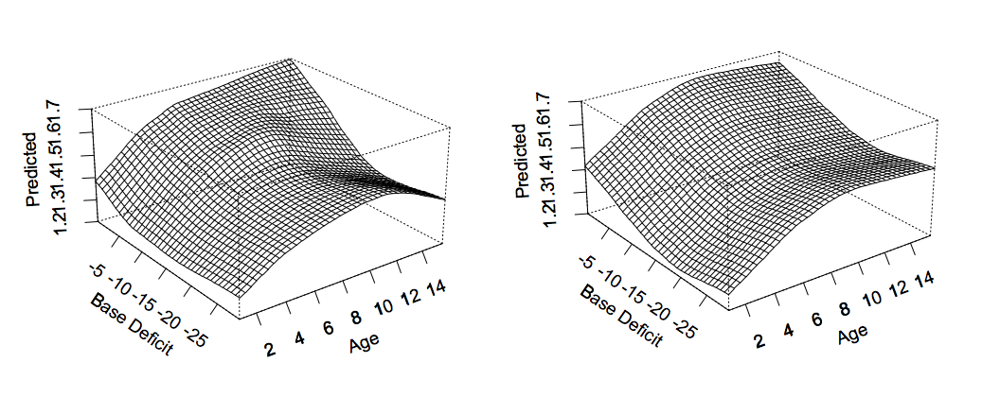
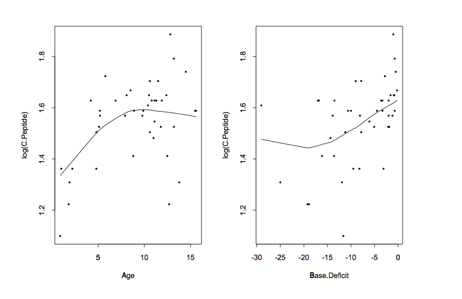

```{r setup, cache = F, echo = F, message = F, warning = F, tidy = F}
# make this an external chunk that can be included in any file
options(width = 100)
opts_chunk$set(message = F, error = F, warning = F, comment = NA, fig.align = 'center', dpi = 100, tidy = F, cache.path = '.cache/', fig.path = 'fig/')

options(xtable.type = 'html')
knit_hooks$set(inline = function(x) {
  if(is.numeric(x)) {
    round(x, getOption('digits'))
  } else {
    paste(as.character(x), collapse = ', ')
  }
})
knit_hooks$set(plot = knitr:::hook_plot_html)
```

## Pro tip

Two things that have really helped me become a better writer:

1.  Write a little bit every day
2.  Read people who are good writers

[This is water](http://web.ics.purdue.edu/~drkelly/DFWKenyonAddress2005.pdf)

---

## Paper of the day

[Maximum likelihood from incomplete data via the EM algorithm](http://web.mit.edu/6.435/www/Dempster77.pdf)

[Don Rubin](http://scholar.google.com/citations?user=5q4fhUoAAAAJ)

---

## Today's slide credits


http://www.biostat.jhsph.edu/~ririzarr/Teaching/754/

---

## Recall the goal


$$Y_i = f(x_i) + \varepsilon_i$$

* $f(x)$ is an unknown function and $\varepsilon_i$ is an error term,
representing random errors in the observations or variability from
sources not included in the $x_i$.
* We assume the errors $\varepsilon_i$ are IID with mean 0 and finite
variance $Var(\varepsilon_i) = \sigma^2$. 

---

## Additive models

* Assume that the response is linear in the
predictors effects and that there is an additive error.
* This allows us to study the effect of each predictor separately. 
$$f(X_1,\dots,X_p) = \sum_{j=1}^p f_j(X_j).$$
* This is a simplification of projection pursuit:
$$f(X_1,\dots,X_p) = \sum_{j=1}^p f_j(\alpha X).$$
with $\alpha X = X_j$. 

---

## Conditional expectation 

Our model assumes: 

$$ E(Y | X_1=x_1, X_2) = f_1(x_1) + f_2(X_2) $$

and

$$E(Y | X_1=x_1', X_2) = f_1(x_1') + f_2(X_2).$$

* It is not easy to disregard the possibility that this dependence changes.

---

## But sometimes this works ok

Example: modeling c-peptide as function of age and base deficit. 



---

## Marginal surfaces

An advantage of additive model is that no matter the dimension of the covariates we know what the surface $f(X_1,\dots,X_p)$ is like by drawing each $f_j(X_j)$ separately.



---

## Fitting additive models: backfitting

If the model is correct then:

$$E\left(\left. Y - \alpha - \sum_{j\neq k} f_j(X_j) \, \right| \,X_k \right) = f_k(X_k) $$

* This suggests an iterative algorithm for computing all the $f_j$.
* Suppose we have estimates $\hat{f}_1,\dots,\hat{f}_{p-1}$
* Then 

$$\left(\left.Y - \hat{\alpha} - \sum_{j=1}^{p-1} \hat{f}_j(X_j) \,\right| \, X_p \right)  \approx f_p(X_p).$$

---

## More backfitting

The partial residuals are  
$$\hat{\epsilon} = Y -\hat{\alpha} - \sum_{j=1}^{p-1} \hat{f}_j(X_j)$$
and
$$\hat{\epsilon}_i \approx f_p(X_{ip}) + \delta_i$$

where $\delta_i$ is approximately IID with mean 0. 

_This is back to our original smoothing framework so these can be fit by smoothing._


---

## The complete algorithm 
 

1. Define $f_j = \{f_j(x_{1j}),\dots,f_j(x_{nj})\}'$ for all $j$.
2. Initialize: $\alpha^{(0)} = \mbox{ave}(y_i)$, $\f_j^{(0)} = $ linear estimate. 
3. Cycle over $j=1,\dots,p$
$$f_j^{(1)} = S_j\left(\left. y - \alpha^{(0)} - \sum_{k\neq j} \mathbf{f}^{(0)}_k\, \right| x_j \right)$$
3. Continue previous step until functions "don't change", for example until 
$$\max_{j} \left|\left| f_j^{(n)} - f_j^{(n-1)} \right|\right| < \delta$$
with $\delta$ is the smallest number recognized by your computer.


---

## Justifying backfitting

* The backfitting algorithm seems to make sense. We can say that we have
given an intuitive justification.
* Statisticians don't like that as a justification. 
* In [ESL](http://statweb.stanford.edu/~tibs/ElemStatLearn/),they justify it in three ways: (1) projections in $L^2$ function spaces, (2) minimizing certain criterion with solutions from reproducing-kernel Hilbert spaces, and (3) as
the solution to penalized least squares.

---

## Backfitting as penalized least squares

Consider the criterion: 
$$\sum_{i=1}^n \left\{ y_i - \sum_{j=1}^p f_j(x_{ij}) \right\}^2 + \sum_{j=1}^p \lambda_j \int \{f_j''(t)\}^2 \, dt$$
over all "p-tuples" of functions $f_1,\ldots,f_p$ that are 2x differentiable. 

We can again show the solution is a set of $p$ natural cubic splines and rewrite the criteria (using the buildup we did for a single variable):

$$\left(y - \sum_{j=1}^p f_j \right)'\left(y - \sum_{j=1}^p f_j \right) + \sum_{j=1}^p \lambda_j f_j K_j f_j$$

where the $K_j$s are penalty matrices for each predictor defined
analogously to the $K$ in a single dimension. 

---

## Backfitting is the solution 

If we differentiate the above equation with respect to the function
$f_j$ we obtain $-2(y - \sum_k f_k) + 2 \lambda_j K_j f_j =0$. The $\hat{f}_j$'s that solve the above equation must satisfy:
$$\hat{f}_j = \left(I + \lambda_j K_j\right)^{-1}\left(y - \sum_{k\neq j} \hat{f}_k\right), j=1,\dots,p $$

If we define the smoother operator $S_j = \left(I + \lambda_j K_j\right)^{-1}$ we can write out this equation in matrix notation 


---

## Matrix notation


* One way to solve this equation is to use the Gauss-Seidel algorithm
which in turn is  equivalent to solving the back-fitting algorithm. See Buja, Hastie \& Tibshirani (1989) Ann. Stat. 17, 435--555 for details.

---

## Standard errors

* Notice that our estimates  $\hat{f}_j$ are no longer of the form $S_j y$ since we have used a complicated backfitting algorithm. 
* At convergence we can express $\hat{f}_j$ as $R_j y$ for some $n \times n$ matrix $R_j$.
* In practice this $R_j$ is obtained from the last calculation of the $\hat{f}_j$'s but finding a closed form is rarely possible. 

---

## Generalized additive models

Say $Y$ has conditional distribution from an exponential family and the
conditional mean of the response $E(Y|X_1,\dots,X_p) = \mu(X_1,\dots,X_p)$ is related to an additive  model through some link functions

$$g\{\mu_i\} = \eta_i = \alpha + \sum_{j=1}^p f_j(x_{ij})$$

with $\mu_i$ the conditional expectation of $Y_i$ given $x_{i1},\dots,x_{ip}$. 

So we can use IRWLS + backfitting.

---

### Motviating a fitting algorithm

As seen for GLM the estimation technique is again motivated by the
approximation:

$$g(y_i) \approx g(\mu_i) + (y_i - \mu_i) \frac{\partial \eta_i}{\partial \mu_i}$$
This motivates a weighted regression setting of the form

$$z_i = \alpha + \sum_{j=1}^p f_j(x_{ij}) + \varepsilon_i, \, i=1,\dots,n$$

with the $\varepsilon$s, the working residuals,  independent with $E(\varepsilon_i) =0$ and 

$$var(\varepsilon_i) = w_i^{-1} = \left( \frac{\partial \eta_i}{\partial
    \mu_i} \right)^2 V_i $$
where $V_i$ is the variance of $Y_i$.

---

## Algorithm

The procedure for estimating the function $f_j$s is called the _local scoring procedure_: 

* Initialize: Find initial values for our estimate:
 
  $$\alpha^{(0)}=g\left(\sum_{i=1}^n y_i/n\right); f^{(0)}_1 =
  \dots,f^{(0)}_p = 0 $$

---

## Algorithm 2

* Update: 
  1. Construct an adjusted dependent variable
    $$z_i = \eta_i^{(0)} + (y_i - \mu_i^{(0)}) \left( \frac{\partial \eta_i}{\partial \mu_i} \right)_0$$
    with $\eta_i^{(0)} = \alpha^{(0)} + \sum_{j=1}^p f^{(0)}_j(x_{ij})$ and $\mu_i^{(0)} = g^{-1}(\eta_i^{(0)})$
 2. Construct weights:
    $$w_i =  \left( \frac{\partial \mu_i}{\partial \eta_i} \right)^2_0
    (V_i^{(0)})^{-1}$$
  3. Fit a weighted additive model to $z_i$, to obtain estimated functions $f_j^{(1)}$, additive predictor $\eta^{(1)}$ and fitted values $\mu^{(1)}_i$.


---

## Algorithm convergence 

* Compute the convergence criteria
    $$\Delta(\eta^{(1)},\eta^{(0)}) = \frac{\sum_{j=1}^p || f_j^{(1)} -
    f_j^{(0)} ||} {\sum_{j=1}^p ||f^{(0)}_j||}$$
* A natural candidate for $||f||$ is $||\mathbf{f}||$, the length of the vector of evaluations of $f$ at the $n$ sample points.
* Repeat previous step replacing $\eta^{(0)}$ by $\eta^{(1)}$ until
  $\Delta(\eta^{(1)},\eta^{(0)})$ is below some small threshold.


---

## Inference with deviance

The deviance or likelihood-ratio statistic, for a fitted model $\hat{\bg{\mu}}$ is defined by 

$$ D(y;\hat{g{\mu}}) = 2\{l(g{\mu}_{max}; y) - l(\hat{g{\mu}})\}$$
where $g{\mu}_{max}$ is the parameter value that maximizes $l(\hat{g{\mu}})$ over all $g{\mu}$ (the saturated model). 
* We sometimes unambiguously use $\hat{g{\eta}}$ as the argument of the deviance rather than $\hat{g{\mu}}$. 
* For GLM if we have two linear models defined by $\eta_1$ nested within $\eta_2$, then under appropriate regularity conditions, and assuming $\eta_1$ is correct, $D(\hat{\eta}_2;\hat{\eta}_1) =D(y;\hat{\eta}_1) - D(y;\hat{\eta}_2)$ has asymptotic $\chi^2$ istribution with degrees of freedom equal to the difference in
degrees of freedom of the two models. 
* There is a heuristic version of this for GAMs (not a big fan)


---

## An example

* Thel data frame has 81 rows representing  data on 81  children  who have had corrective spinal surgery.  The binary outcome Kyphosis indicates the presence or absence of a postoperative
 deformity (called Kyphosis). 
 * The other threevariables are _Age_ in months, _Number_ of vertebra involved in the
 operation, and  the beginning of the range of vertebrae involved _Start_. 
 
 
```{r kyph}
library(rpart); data(kyphosis); kyphosis$present = (kyphosis$Kyphosis == "present")
head(kyphosis)
```


---

## An example

```{r glmk,dependson="kyph"}
glm1 = glm(present ~ Age + Number + Start, data = kyphosis,family="binomial")
summary(glm1)
```


---

## Residuals don't look great


---

## Fit it with GAM

```{r gamk,dependson="kyph"}
library(mgcv)
gam1 = gam(present~s(Age)  + s(Number,k=3) +  s(Start), data = kyphosis,family="binomial")
summary(gam1)
```

---

## Example resids (from slightly different model)


