## Pro tip

In academia your goal is to "get famous". Not Bieber famous. Famous in the way that lots of people
know about and respect your ideas/creativity/independence. A frustrating, but important aspect of this
is that if you have a good idea you need to write about it a lot to make sure people remember it was
you that came up with it. 

---

## Paper of the day

[Harnessing naturally randomized transcription to infer regulatory 
relationships among genes](http://www.genomine.org/papers/Chen_etal_GB_2007.pdf)

[Estimating high-dimensional intervention effects from observational data.](ftp://ftp.stat.math.ethz.ch/Research-Reports/Other-Manuscripts/buhlmann/AOS685.pdf)

---

## Today's slide credits

Some usesful resources

* Cosma Shalizi
  * http://www.stat.cmu.edu/~cshalizi/ADAfaEPoV/ADAfaEPoV.pdf
* Elizabeth Stuart
  * https://github.com/jtleek/jhsph753and4/blob/master/lectures/stuartcausal1.pdf
  * https://github.com/jtleek/jhsph753and4/blob/master/lectures/stuartcausal2.pdf
* Judea Pearl
  * http://ftp.cs.ucla.edu/pub/stat_ser/r350.pdf
* Eric Xing
  * http://www.cs.cmu.edu/~epxing/Class/10708-05/Slides/causality.pdf

---

## Basic idea

* When can we use experimental data to tell us about the effect of an intervention
* Basically when can we get $Pr(Y | set(X) = x, Z=z)$ from $Pr(Y | X=x,Z=z)$
* Association is symmetric $ X \not\perp Y \Leftrightarrow Y \not\perp X$
* Causation is asymmetric $X \rightarrow Y \not\Leftrightarrow Y \rightarrow X$

---

## Direct causation

$X$ is a direct cause to $Y$ relative to $S$ iff

$$P(Y | set(X)=x1,set(Z=z)) \neq P(Y | set(X)=x2,set(Z=z))$$

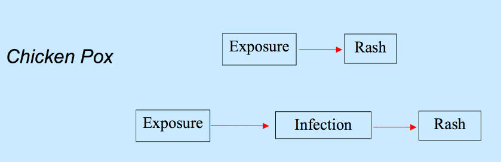

---

## Need to know all "confounders"

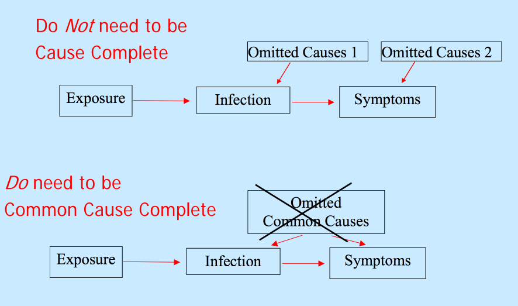

---

## Can do this with intervention

But be careful of "fat hand" interventions that don't directly act on the thing you care about

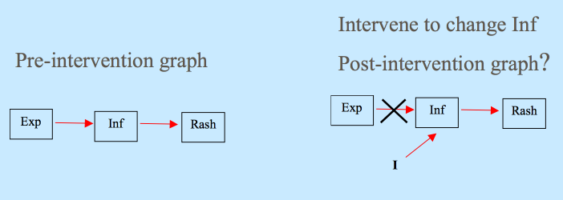

---

## Structural equation models

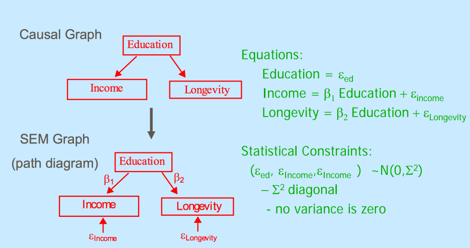

---

## Connecting probability to causal structure

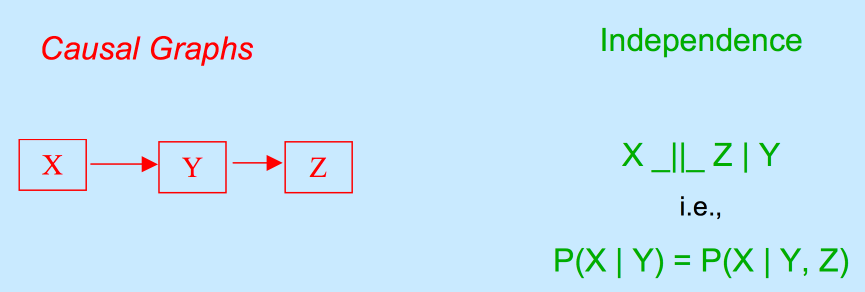

1. There is a directed acyclic graph
2. __The Causal Markov condition:__ The joint distribution of the variables obeys
the Markov property on G.
  * Immediate causes make things independent of remote causes
  * Common causes make their effects independent
3. __Faithfulness:__ The joint distribution has all of the conditional independence
relations implied by the causal Markov property, and only those conditional
independence relations

---

## Causal Markov property

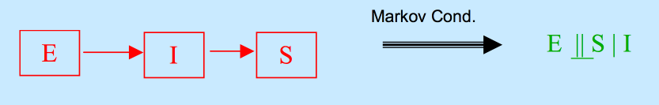

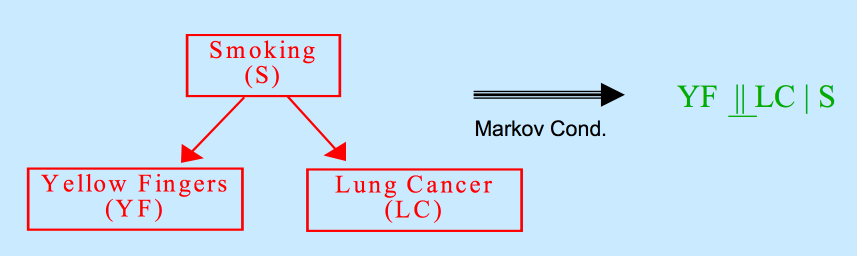

---

## D-separation

If two variables are independent (don't have a connected, non-coliding line) conditional on a third. 

* In SEMs you get this from assuming error terms are independent if they don't have a path connectino
* In acyclic graphs: d-separation is equivalent to Causal Markov
* In Cyclic SEMs with uncorrelated errors
  * D-separation is still correct
  * Markov condition is incorrect
* In Cyclic discrete variable graphs
  * If equilibrium then d-separation is correct
  * Markov is incorrect

---

## Why we want d-separation

http://mlg.eng.cam.ac.uk/zoubin/SALD/Intro-Causal.pdf

---

## How these algorithms work

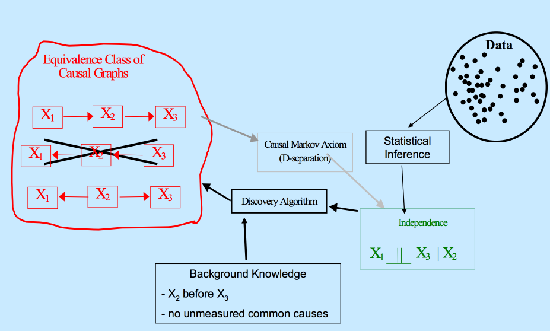

---

## Equivalence classes implied by independence assumptions

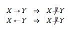

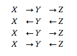

http://www.stat.cmu.edu/~cshalizi/ADAfaEPoV/ADAfaEPoV.pdf

---

## Partial ancestral graphs

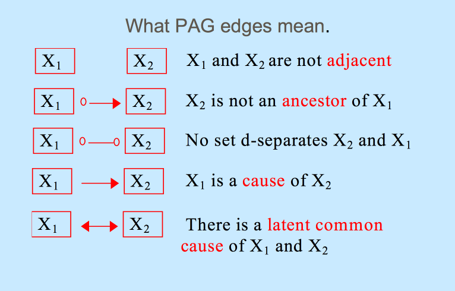

---

## Partial ancestral graphs

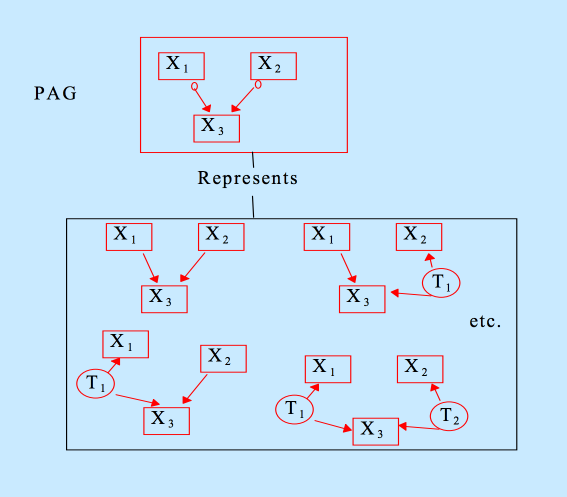

---

## Create equivalence classes from data

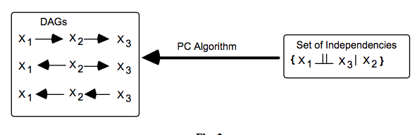

http://mlg.eng.cam.ac.uk/zoubin/SALD/Intro-Causal.pdf

---

## The "eliminate graphs" approach

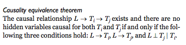

__Basic idea__:

1. Make equivalence class of possible graphs
2. Eliminate some with Causal Markov property
3. Eliminate some with faithfulness
4. Eliminate others based on correlations
5. Hopefully you are left with one :-)

http://www.genomine.org/papers/Chen_etal_GB_2007.pdf

---

## The "sensitivity" approach

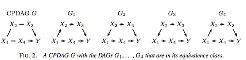

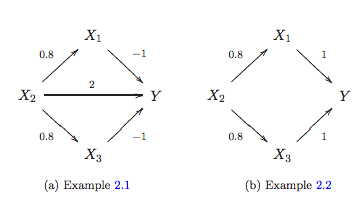

1. Estimate equivalence class of possible graphs
2. Use DAGs/Causal Markov to eliminate potential models
3. Fit each "structural equation model"
4. Use property of estimated model fits across models (max,min,etc.) to estimate graphical structure

---

## Interesting application

http://www.nature.com/nmeth/journal/v7/n4/full/nmeth0410-247.html

---

## R software

* http://cran.r-project.org/web/packages/pcalg/index.html
* http://www.bioconductor.org/packages/release/bioc/html/trigger.html

Many more I haven't listed

