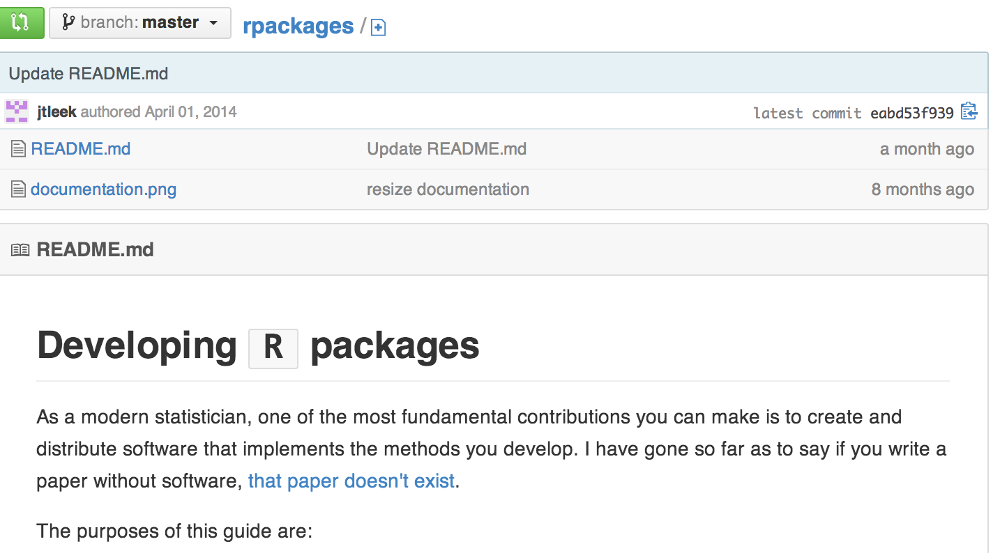
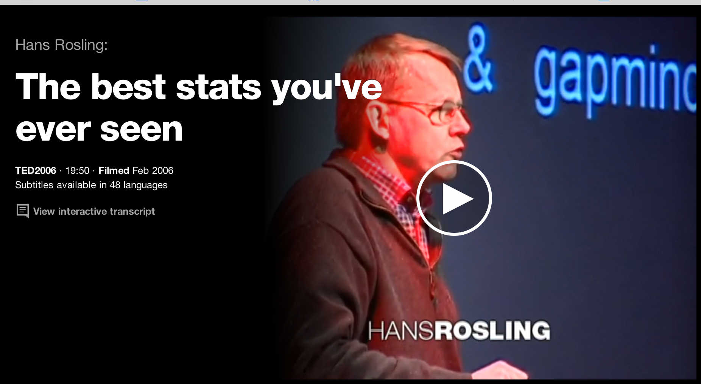
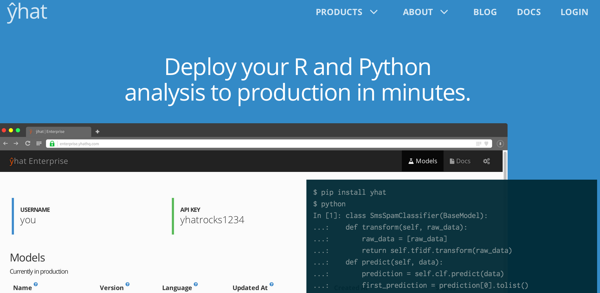

```{r setup, cache = F, echo = F, message = F, warning = F, tidy = F}
# make this an external chunk that can be included in any file
options(width = 100)
opts_chunk$set(message = F, error = F, warning = F, comment = NA, fig.align = 'center', dpi = 100, tidy = F, cache.path = '.cache/', fig.path = 'fig/')

options(xtable.type = 'html')
knit_hooks$set(inline = function(x) {
  if(is.numeric(x)) {
    round(x, getOption('digits'))
  } else {
    paste(as.character(x), collapse = ', ')
  }
})
knit_hooks$set(plot = knitr:::hook_plot_html)
```

## Pro tip

Try to find people to work with who are much smarter than you. If they are friendly and fun to work with it is even better. A huge fraction of any success I have I owe to working with these folks:

* Jim Powell
* John Storey
* Giovanni Parmigiani
* Rafa Irizarry

All *way* smarter/better than me at academics. 

---

## Paper of the day


[Data driven documents](http://vis.stanford.edu/files/2011-D3-InfoVis.pdf)


---

## Examples of data products

* R packages
* Interactive graphics
* Apps
* APIs


---

## Writing R packages

* Here are some links from people who are pros
  * [Hadley's master class](http://courses.had.co.nz/12-devtools/)
  * [Creating R packages tutorial](http://cran.r-project.org/doc/contrib/Leisch-CreatingPackages.pdf)
  * [Writing R extensions](http://cran.r-project.org/doc/manuals/R-exts.html)
* Coding style
  * [Bioconductor](http://www.bioconductor.org/developers/package-guidelines/)
  * [Hadley Wickham's version](https://github.com/hadley/devtools/wiki/Style)
  * [Google's R style guide](http://google-styleguide.googlecode.com/svn/trunk/google-r-style.html)

---

## Why write an R package?

* You were told to for your final
* [If there is no code, there is no paper](http://simplystatistics.org/2013/01/23/statisticians-and-computer-scientists-if-there-is-no-code-there-is-no-paper/)
* Getting noticed (see e.g. [Yihui](http://yihui.name/))
* Getting cited (see e.g. [RMA](http://www.ncbi.nlm.nih.gov/pubmed/12925520), [sva](http://www.plosgenetics.org/article/info:doi/10.1371/journal.pgen.0030161) )
* To avoid the [statistics boogeyman](http://odin.mdacc.tmc.edu/~kabaggerly/)
* Because it is when you really learn how/why your method works
* To put together a set of functions that implement a method, or [are useful to you](http://hilaryparker.com/2013/04/03/personal-r-packages/), or summarize a body of work (like a dissertation)

---

## First step: naming

* Make it googleable 
* Be a little cute, but not too much
* Avoid caps 
* Package name must start with a letter
* r"method" or r"technology" is a good place to start, see e.g. [rOpenSci](http://ropensci.org/packages/index.html)
* Never let Rafa name your method ("Succs", "BumpHunter", "DER Finder")

---

## If you want your software to be used

<center> Documentation > Usability > Speed > Statistical superiority</center>


---

## Preliminaries: version control

[What is version control](http://git-scm.com/video/what-is-version-control)

* [Github](https://github.com/) - where the cool nerds are
* [Bitbucket](https://bitbucket.org/) - where the real nerds are
* [svn](http://subversion.tigris.org/) - where the old nerds are
* Files on your desktop - where the frustrated nerds are

---

## Preliminaries: repositories

* [CRAN](http://cran.us.r-project.org/)
  * All types of packages
  * Minimal QC
* [Bioconductor](http://www.bioconductor.org/)
  * Mostly genomics packages
  * Peer review/high QC
* [Github](https://github.com/)
  * Any type 
  * No QC

---

## Getting started - load packages


```{r load, eval=FALSE}
install.packages("devtools")
install.packages("rogxygen2")
install.packages("textthat")
library(devtools); library(roxygen2);library(testthat)
```


---

## Create a package

```{r,dependson="load"}
# Set working directory
setwd("~/Desktop")

# Create a new package
create("fdrreg")

```

<center> Add stuff to package now</center>

---

## R code

* Just like you would usually write
* Goes in the R/ directory
* Should be multiple files - one per major "method" at minimum
* Documentation included in files makes it easier

---

## Documenting R code with roxygen2

<center> Show example </center>

__Example documentation__

@param - Inputs

@examples - examples

@author - who wrote the function

@seealso - refers to other packages

@return - what it returns

See more [here](http://courses.had.co.nz/12-devtools/slides/8-documentation.pdf)


---

## How to use this

```{r,eval=FALSE}
document("pkg")
check_doc("pkg")
show_rd(,"pkg")
```

---

## Testing R code with testthat

__Use expect_that to define subtests__

expect_that(1,equals(1))

__Example tests__

is_truth

is_false

equals

matches

prints_text

__Then arrange together__

test_that("test name", {
 expect_that(1,equals(1))
})

See more [here](http://journal.r-project.org/archive/2011-1/RJournal_2011-1_Wickham.pdf)

---

## How to use it

* Create tests in inst/tests
* Each file can test one component
* Start file with _context("Name for set of tests")_
* To test run:
  * test_file()
  * test_dir()
* Or you can do it when running R CMD CHECK with a file tests/run_all.R with
```{r,eval=FALSE}
library(testthat)
library(mypackage)
test_package("mypackage")
```

---

## Vignettes versus README files

* Vignettes 
  * Go in inst/man
  * Are written in Sweave
  * Are required for Bioconductor
* README
  * Can be written in markdown
  * Often useful if Github is where you will put your documentation
* [Markdown vignettes](http://yihui.name/en/2012/09/r-package-markdown-vignettes/)

---

## Releasing package

* On Github you can just post the package then tell users to do

```{r,eval=FALSE}
library(devtools)
install_github("package","username")
```

* Or for CRAN use 
```{r,eval=FALSE}
release()
```

* Or for BioC see [here](http://www.bioconductor.org/developers/)

More on this [here](http://courses.had.co.nz/12-devtools/slides/10-release.pdf)


---

## If it is an important package



https://github.com/jtleek/rpackages

---

## Pretty pictures

* [manipulate](http://www.rstudio.com/ide/docs/advanced/manipulate)
* [rCharts](http://rcharts.io/)
* [googleVis](http://cran.r-project.org/web/packages/googleVis/vignettes/googleVis.pdf)
* [ggvis](http://ggvis.rstudio.com/)


----

## Manipulate
- Suppose that you want to create a quick interactive graphic
  - You have to do it *now* 
  - The intended users also use Rstudio
- `manipulate` is a really cool solution that is often all you need to quickly make interactive graphics

---
## Documentation
- Manipulate is well documented at the Rstudio web site here
  - http://www.rstudio.com/ide/docs/advanced/manipulate
- From there, try this
```
library(manipulate)
manipulate(plot(1:x), x = slider(1, 100))
```
- You can create a slider, checkbox, or picker (drop down) and have more than one

---

## Example
```
library(UsingR)
data(galton)
library(manipulate)
myHist <- function(mu){
  hist(galton$child,col="blue",breaks=100)
  lines(c(mu, mu), c(0, 150),col="red",lwd=5)
  mse <- mean((galton$child - mu)^2)
  text(63, 150, paste("mu = ", mu))
  text(63, 140, paste("MSE = ", round(mse, 2)))
}
manipulate(myHist(mu), mu = slider(62, 74, step = 0.5))
```

---

## Google Vis API


https://developers.google.com/chart/interactive/docs/gallery


---

## Basic idea

* The R function creates an HTML page
* The HTML page calls Google Charts
* The result is an interactive HTML graphic

---

## Watch Hans Rosling be awesome




http://www.ted.com/talks/hans_rosling_shows_the_best_stats_you_ve_ever_seen


---

## Example 

```{r gv,results="asis"}
suppressPackageStartupMessages(library(googleVis))
M <- gvisMotionChart(Fruits, "Fruit", "Year",
                     options=list(width=600, height=400))
print(M,"chart")
```

---

## Charts in googleVis

<center> "gvis + ChartType" </center>

* Motion charts:  `gvisMotionChart`
* Interactive maps: `gvisGeoChart`
* Interactive tables: `gvisTable`
* Line charts: `gvisLineChart`
* Bar charts: `gvisColumnChart`
* Tree maps: `gvisTreeMap`

http://cran.r-project.org/web/packages/googleVis/googleVis.pdf

---

## Plots on maps

```{r,dependson="gv",results="asis"}
G <- gvisGeoChart(Exports, locationvar="Country",
                  colorvar="Profit",options=list(width=600, height=400))
print(G,"chart")
```


---

## Specifying a region

```{r,dependson="gv",results="asis"}
G2 <- gvisGeoChart(Exports, locationvar="Country",
                  colorvar="Profit",options=list(width=600, height=400,region="150"))
print(G2,"chart")
```

---

## Finding parameters to set under `options`


https://developers.google.com/chart/interactive/docs/gallery/geochart

---

## Setting more options

```{r linechart,dependson="gv",results="asis"}
df <- data.frame(label=c("US", "GB", "BR"), val1=c(1,3,4), val2=c(23,12,32))
Line <- gvisLineChart(df, xvar="label", yvar=c("val1","val2"),
        options=list(title="Hello World", legend="bottom",
                titleTextStyle="{color:'red', fontSize:18}",                         
                vAxis="{gridlines:{color:'red', count:3}}",
                hAxis="{title:'My Label', titleTextStyle:{color:'blue'}}",
                series="[{color:'green', targetAxisIndex: 0}, 
                         {color: 'blue',targetAxisIndex:1}]",
                vAxes="[{title:'Value 1 (%)', format:'##,######%'}, 
                                  {title:'Value 2 (\U00A3)'}]",                          
                curveType="function", width=500, height=300                         
                ))
```

https://github.com/mages/Introduction_to_googleVis/blob/gh-pages/index.Rmd

---

## Setting more options

```{r ,dependson="linechart",results="asis"}
print(Line,"chart")
```


---

## Combining multiple plots together

```{r multiplot,dependson="gv",results="asis"}
G <- gvisGeoChart(Exports, "Country", "Profit",options=list(width=200, height=100))
T1 <- gvisTable(Exports,options=list(width=200, height=270))
M <- gvisMotionChart(Fruits, "Fruit", "Year", options=list(width=400, height=370))
GT <- gvisMerge(G,T1, horizontal=FALSE)
GTM <- gvisMerge(GT, M, horizontal=TRUE,tableOptions="bgcolor=\"#CCCCCC\" cellspacing=10")
```

---

## Combining multiple plots together

```{r,dependson="multiplot",results="asis"}
print(GTM,"chart")
```


---

## Seeing the HTML code

```{r ,dependson="gv"}
M <- gvisMotionChart(Fruits, "Fruit", "Year", options=list(width=600, height=400))
print(M)
print(M, 'chart', file='myfilename.html')
```

---

## Things you can do with Google Vis

* The visualizations can be embedded in websites with HTML code
* Dynamic visualizations can be built with Shiny, Rook, and R.rsp
* Embed them in [R markdown](http://www.rstudio.com/ide/docs/authoring/using_markdown) based documents
  * Set `results="asis"` in the chunk options
  * Can be used with [knitr](http://cran.r-project.org/web/packages/knitr/index.html) and [slidify](http://slidify.org/)


---

## For more info

```{r,eval=FALSE}
demo(googleVis)
```

* http://cran.r-project.org/web/packages/googleVis/vignettes/googleVis.pdf
* http://cran.r-project.org/web/packages/googleVis/googleVis.pdf
* https://developers.google.com/chart/interactive/docs/gallery
* https://developers.google.com/chart/interactive/faq


---

## rCharts

- rCharts is a way to create interactive javascript visualizations using R
- So
  - You don't have to learn complex tools, like D3
  - You simply work in R learning a minimal amount of new syntaxt
- rCharts was written by Ramnath Vaidyanathan (friend of the Data Science Series), who also wrote slidify, the framework we use for all of the lectures in the class
- This lecture is basically going through
  (http://ramnathv.github.io/rCharts/)

---
## Example
```
require(rCharts)
haireye = as.data.frame(HairEyeColor)
n1 <- nPlot(Freq ~ Hair, group = 'Eye', type = 'multiBarChart',
  data = subset(haireye, Sex == 'Male')
)
n1$save('fig/n1.html', cdn = TRUE)
cat('<iframe src="fig/n1.html" width=100%, height=600></iframe>')
```

---
## nvD3 run
```{r, echo = FALSE, results = 'hide'}
require(rCharts)
```
```{r echo = FALSE, results = 'asis'}
haireye = as.data.frame(HairEyeColor)
n1 <- nPlot(Freq ~ Hair, group = 'Eye', type = 'multiBarChart',
  data = subset(haireye, Sex == 'Male')
)
n1$save('fig/n1.html', cdn = TRUE)
cat('<iframe src="fig/n1.html" width=100%, height=600></iframe>')
```

---
## Slidify interactive
- The above was an example of embedding an rChart in a slidify document
  - In the YAML 
```yaml ext_widgets : {rCharts: ["libraries/nvd3"]}```
- Or, if you use more than one library
- YAML example
```yaml ext_widgets : {rCharts: ["libraries/highcharts", "libraries/nvd3", "libraries/morris"]}``` 

---
## Viewing the plot
- The object `n1` contains the plot
  - In RStudio, typing `n1` brings up the plot in the RStudio viewer (or you can just not assign it to an object)
- Do `n1$` then hit TAB to see the various functions contained in the object
  - `n1$html()` prints out the html for the plot
- I do `n1$save(filename)` then bring the code back into slidify document
  - This is recommended for slidify, but if you're just looking at the plot,
  it's unnecessary

---
## Deconstructing another example
```
## Example 1 Facetted Scatterplot
names(iris) = gsub("\\.", "", names(iris))
r1 <- rPlot(SepalLength ~ SepalWidth | Species, data = iris, color = 'Species', type = 'point')
r1$save('fig/r1.html', cdn = TRUE)
cat('<iframe src="fig/r1.html" width=100%, height=600></iframe>')
```


---
## When run
```{r echo = FALSE, results = 'asis'}
## Example 1 Facetted Scatterplot
names(iris) = gsub("\\.", "", names(iris))
r1 <- rPlot(SepalLength ~ SepalWidth | Species, data = iris, color = 'Species', type = 'point')
r1$save('fig/r1.html', cdn = TRUE)
cat('<iframe src="fig/r1.html" width=100%, height=600></iframe>')
```

---
## Example 2 Facetted Barplot
```
hair_eye = as.data.frame(HairEyeColor)
r2 <- rPlot(Freq ~ Hair | Eye, color = 'Eye', data = hair_eye, type = 'bar')
r2$save('fig/r2.html', cdn = TRUE)
cat('<iframe src="fig/r2.html" width=100%, height=600></iframe>')
```

---
## Example 2 Facetted Barplot, when run
```{r echo = FALSE, results = 'asis'}
hair_eye = as.data.frame(HairEyeColor)
r2 <- rPlot(Freq ~ Hair | Eye, color = 'Eye', data = hair_eye, type = 'bar')
r2$save('fig/r2.html', cdn = TRUE)
cat('<iframe src="fig/r2.html" width=100%, height=600></iframe>')
```


---
## How to get the js/html or publish an rChart
Now you can add whatever you'd like
```{r echo = TRUE, results = 'hide', eval=FALSE}
r1 <- rPlot(mpg ~ wt | am + vs, data = mtcars, type = "point", color = "gear")
r1$print("chart1") # print out the js 
r1$save('myPlot.html') #save as html file
r1$publish('myPlot', host = 'gist') # save to gist, rjson required
r1$publish('myPlot', host = 'rpubs') # save to rpubs
```


---
## rCharts has links to several libraries
- We'll do some examples
- Note Ramnath mentions that io2012 and polychart have conflicting js
  - They seem to work for me with that theme, but I get errors if I load the polychart library
  - If debugging with io and polychart, factor that in


---
## morris
```
data(economics, package = "ggplot2")
econ <- transform(economics, date = as.character(date))
m1 <- mPlot(x = "date", y = c("psavert", "uempmed"), type = "Line", data = econ)
m1$set(pointSize = 0, lineWidth = 1)
m1$save('fig/m1.html', cdn = TRUE)
cat('<iframe src="fig/m1.html" width=100%, height=600></iframe>')
```

---
## morris example run
```{r echo = FALSE, results = 'asis'}
data(economics, package = "ggplot2")
econ <- transform(economics, date = as.character(date))
m1 <- mPlot(x = "date", y = c("psavert", "uempmed"), type = "Line", data = econ)
m1$set(pointSize = 0, lineWidth = 1)
m1$save('fig/m1.html', cdn = TRUE)
cat('<iframe src="fig/m1.html" width=100%, height=600></iframe>')
```

---
## xCharts
```
require(reshape2)
uspexp <- melt(USPersonalExpenditure)
names(uspexp)[1:2] = c("category", "year")
x1 <- xPlot(value ~ year, group = "category", data = uspexp, type = "line-dotted")
x1$save('fig/x1.html', cdn = TRUE)
cat('<iframe src="fig/x1.html" width=100%, height=600></iframe>')
```

---
## xCharts run
```{r echo = FALSE, results = 'asis'}
require(reshape2)
uspexp <- melt(USPersonalExpenditure)
names(uspexp)[1:2] = c("category", "year")
x1 <- xPlot(value ~ year, group = "category", data = uspexp, type = "line-dotted")
x1$save('fig/x1.html', cdn = TRUE)
cat('<iframe src="fig/x1.html" width=100%, height=600></iframe>')
```

---
## Leaflet
```
map3 <- Leaflet$new()
map3$setView(c(51.505, -0.09), zoom = 13)
map3$marker(c(51.5, -0.09), bindPopup = "<p> Hi. I am a popup </p>")
map3$marker(c(51.495, -0.083), bindPopup = "<p> Hi. I am another popup </p>")
map3$save('fig/map3.html', cdn = TRUE)
cat('<iframe src="fig/map3.html" width=100%, height=600></iframe>')
```

---
## Leaflet run
```{r echo = FALSE, results = 'asis'}
map3 <- Leaflet$new()
map3$setView(c(51.505, -0.09), zoom = 13)
map3$marker(c(51.5, -0.09), bindPopup = "<p> Hi. I am a popup </p>")
map3$marker(c(51.495, -0.083), bindPopup = "<p> Hi. I am another popup </p>")
map3$save('fig/map3.html', cdn = TRUE)
cat('<iframe src="fig/map3.html" width=100%, height=600></iframe>')
```

---
## Rickshaw
```
usp = reshape2::melt(USPersonalExpenditure)
# get the decades into a date Rickshaw likes
usp$Var2 <- as.numeric(as.POSIXct(paste0(usp$Var2, "-01-01")))
p4 <- Rickshaw$new()
p4$layer(value ~ Var2, group = "Var1", data = usp, type = "area", width = 560)
# add a helpful slider this easily; other features TRUE as a default
p4$set(slider = TRUE)
p4$save('fig/p4.html', cdn = TRUE)
cat('<iframe src="fig/p4.html" width=100%, height=600></iframe>')
```

---
## Rickshaw run
```{r echo = FALSE, results = 'asis'}
usp = reshape2::melt(USPersonalExpenditure)
# get the decades into a date Rickshaw likes
usp$Var2 <- as.numeric(as.POSIXct(paste0(usp$Var2, "-01-01")))
p4 <- Rickshaw$new()
p4$layer(value ~ Var2, group = "Var1", data = usp, type = "area", width = 560)
# add a helpful slider this easily; other features TRUE as a default
p4$set(slider = TRUE)
p4$save('fig/p4.html', cdn = TRUE)
cat('<iframe src="fig/p4.html" width=100%, height=600></iframe>')
```


---
## rCharts summarized
- rCharts makes creating interactive javascript visualizations in R ridiculously easy
- However, non-trivial customization is going to require knowledge of javascript
- If what you want is not too big of a deviation from the rCharts examples, then it's awesome
  - Otherwise, it's challenging to extend without fairly deep knowledge of the JS
    libraries that it's calling.
- rCharts is under fairly rapid development


---


## What is Shiny?

- Shiny is a platform for creating interactive R programs embedded into a web page.
- Suppose that you create a prediction algorithm, with shiny you can *very easily* create web input form that calls R and thus your prediction algorithm and displays the results.
- Using Shiny, the time to create simple, yet powerful, web-based interactive data products in R is minimized.
  - However, it lacks the flexibility of full featured (and more complex) solutions.
- Shiny is made by the fine folks at R Studio.

---
## Some mild prerequisites 
- Shiny doesn't really require it, but as with all web programming, a little knowledge of html, css and js is very helpful
  - html gives a web page structure and sectioning as well as markup instructions
  - css gives the style
  - js for interactivity
- There are too many tutorials online to count for getting basic proficiency in these topics to count. 
- Shiny uses [bootstrap](http://getbootstrap.com/) (no relation to the statistics bootstrap) style, which (to me) seems to look nice and renders well on mobile platforms

---
## What else is out there?
- Creating any solution requiring fairly deep knowledge of web client/server programming
- [OpenCPU](https://public.opencpu.org/) by Jerome Ooms, is a really neat project providing an API for calling R from web documents
  - And he even hosts an OpenCPU server, but you can create your own

---
## Context
- You created a novel prediction algorithm to predict risk for developing
  diabetes.
    - You're hoping patients and caregivers will be able to enter their data and, if needed, take preventative measures.
- You want to create a web site so that users can input the relevant predictors and obtain their prediction.
- Your prediction algorithm (ok, so you're not going to be saving the world with this one)
  - [link for a real prediction score](http://www.ncbi.nlm.nih.gov/pubmed/12610029)
```{r}
diabetesRisk <- function(glucose) glucose / 200
```


---
## Getting started
- Make sure you have the latest release of R installed
- If on windows, make sure that you have Rtools installed
- `install.packages("shiny")`
- `libray(shiny)`
- Great tutorial at 
[http://rstudio.github.io/shiny/tutorial/](http://rstudio.github.io/shiny/tutorial/)
- Basically, this lecture is walking through that tutorial offering some of our insights
- Note, some of the proposed interactive plotting uses of Shiny could be handled by the very simple `manipulate` function [rstudio manipulate](http://www.rstudio.com/ide/docs/advanced/manipulate)
- Also, `rCharts` is will be covered in a different lecture.

---
## A Shiny project
- A shiny project is a directory containing at least two parts
  - One named ui.R (for user interface) controls how it looks.
  - One named server.R that controls what it does.

---
## ui.R
```
library(shiny)
shinyUI(pageWithSidebar(
  headerPanel("Data science FTW!"),
  sidebarPanel(
    h3('Sidebar text')
  ),
  mainPanel(
      h3('Main Panel text')
  )
))
```

---
## server.r
```
library(shiny)
shinyServer(
  function(input, output) {
  }
)
```

---
## To run it
- In R, change to the directories with these files and type `runApp()`
- or put the path to the directory as an argument
- It should open an browser window with the app running

---


---
## R functions for HTML markup
`ui.R`
```
shinyUI(pageWithSidebar(
  headerPanel("Illustrating markup"),
  sidebarPanel(
      h1('Sidebar panel'),
      h1('H1 text'),
      h2('H2 Text'),
      h3('H3 Text'),
      h4('H4 Text')
      
  ),
  mainPanel(
      h3('Main Panel text'),
      code('some code'),
      p('some ordinary text')
  )
))

```

---


---
## Illustrating inputs ui.R
```
shinyUI(pageWithSidebar(
  headerPanel("Illustrating inputs"),
  sidebarPanel(
    numericInput('id1', 'Numeric input, labeled id1', 0, min = 0, max = 10, step = 1),
    checkboxGroupInput("id2", "Checkbox",
                   c("Value 1" = "1",
                     "Value 2" = "2",
                     "Value 3" = "3")),
    dateInput("date", "Date:")  
  ),
  mainPanel(
      
  )
))
```

---


---
## Part of ui.R
```
  mainPanel(
        h3('Illustrating outputs'),
        h4('You entered'),
        verbatimTextOutput("oid1"),
        h4('You entered'),
        verbatimTextOutput("oid2"),
        h4('You entered'),
        verbatimTextOutput("odate")
  )
```

---
## server.R
```
shinyServer(
  function(input, output) {
    output$oid1 <- renderPrint({input$id1})
    output$oid2 <- renderPrint({input$id2})
    output$odate <- renderPrint({input$date})
  }
)
```

---


---
## Let's build our prediction function

```
shinyUI(
  pageWithSidebar(
    # Application title
    headerPanel("Diabetes prediction"),
  
    sidebarPanel(
      numericInput('glucose', 'Glucose mg/dl', 90, min = 50, max = 200, step = 5),
      submitButton('Submit')
    ),
    mainPanel(
        h3('Results of prediction'),
        h4('You entered'),
        verbatimTextOutput("inputValue"),
        h4('Which resulted in a prediction of '),
        verbatimTextOutput("prediction")
    )
  )
)
```

---
## server.R
```
diabetesRisk <- function(glucose) glucose / 200

shinyServer(
  function(input, output) {
    output$inputValue <- renderPrint({input$glucose})
    output$prediction <- renderPrint({diabetesRisk(input$glucose)})
  }
)
```

---
## The result


---
## Image example
- Let's build an example with an image
- How about we create a histogram of data
- Put a slider on so that the user has to guess the mean

---
## ui.R
```
shinyUI(pageWithSidebar(
  headerPanel("Example plot"),
  sidebarPanel(
    sliderInput('mu', 'Guess at the mean',value = 70, min = 62, max = 74, step = 0.05,)
  ),
  mainPanel(
    plotOutput('newHist')
  )
))
```

---
## server.R
```
library(UsingR)
data(galton)

shinyServer(
  function(input, output) {
    output$newHist <- renderPlot({
      hist(galton$child, xlab='child height', col='lightblue',main='Histogram')
      mu <- input$mu
      lines(c(mu, mu), c(0, 200),col="red",lwd=5)
      mse <- mean((galton$child - mu)^2)
      text(63, 150, paste("mu = ", mu))
      text(63, 140, paste("MSE = ", round(mse, 2)))
      })
    
  }
)
```

---
## The output


---
## Tighter control over style
- All of the style elements are handled through ui.R
- Instead, you can create a www directory and then an index.html file in that directory
  - [This link](http://rstudio.github.io/shiny/tutorial/#html-ui) goes through the html needed
  - You just have to have specific js libraries and appropriately name ids and classes. This is beyond the scope of this class
  - For students with a lot of experience in html, js, css it would be a breeze and probably easier and more flexible than the R html controls in ui.R

---
## Other things Shiny can do
- Allow users to upload or download files
- Have tabbed main panels
- Have editable data tables
- Have a dynamic UI
- User defined inputs and outputs 
- Put a submit button so that Shiny only executes complex code after user hits submit


---
## Distributing a Shiny app
- The quickest way is to send (or put on github or gist or dropbox or whatever) someone the app directory and they can then call `runApp`
- You could create an R package and create a wrapper that calls `runApp`  
  - Of course, these solutions only work if the user knows R
- Another option is to run a shiny server
  - Requires setting up a (Shiny server)[http://www.rstudio.com/shiny/server/]
    - Probably easiest if you use one of the virtual machines where they already have Shiny servers running well (for example, on AWS)
  - Setting up a Shiny server is beyond the scope of this class as it involves some amount of linux server administration
  - Groups are creating a Shiny hosting services that will presumably eventually be a fee for service or freemium service
  - BTW, don't put system calls in your code (this is one of the first things many of us do for fun, but it introduces security concerns)


---

## yhat and apis




---

## yhat example

Use data from here: http://aqsdr1.epa.gov/aqsweb/aqstmp/airdata/download_files.html

```
d <- read.csv("annual_all_2013.csv", nrow = 68210)
sub <- subset(d, Parameter.Name %in% c("PM2.5 - Local Conditions", "Ozone")
              & Pullutant.Standard %in% c("Ozone 8-Hour 2008", "PM25 Annual 2006"),
              c(Longitude, Latitude, Parameter.Name, Arithmetic.Mean))

pollavg <- aggregate(sub[, "Arithmetic.Mean"],
                     sub[, c("Longitude", "Latitude", "Parameter.Name")],
                     mean, na.rm = TRUE)
pollavg$Parameter.Name <- factor(pollavg$Parameter.Name, labels = c("ozone", "pm25"))
names(pollavg)[4] <- "level"
```

---


## Write function

```
monitors <- data.matrix(pollavg[, c("Longitude", "Latitude")])

library(fields)

pollutant <- function(df) {
        x <- data.matrix(df[, c("lon", "lat")])
        r <- df$radius
        d <- rdist.earth(monitors, x)
        use <- lapply(seq_len(ncol(d)), function(i) {
                which(d[, i] < r[i])
        })
        levels <- sapply(use, function(idx) {
                with(pollavg[idx, ], tapply(level, Parameter.Name, mean))
        })
        dlevel <- as.data.frame(t(levels))
        data.frame(df, dlevel)
}
```

---

## Send to yhat

```
ibrary(yhatr)

model.require <- function() {
        library(fields)
}

model.transform <- function(df) {
        df
}

model.predict <- function(df) {
        pollutant(df)
}

yhat.config  <- c(
        username="USERNAME",
        apikey="YOUR KEY",
        env="http://sandbox.yhathq.com/"
)

yhat.deploy("pollutant")
```

---

## Calling it from R (least interesting)

```
library(yhatr)
yhat.config  <- c(
        username="USERNAME",
        apikey="YOUR KEY",
        env="http://sandbox.yhathq.com/"
)
df <- data.frame(lon = c(-76.6167, -118.25), lat = c(39.2833, 34.05),
                 radius = 20)
yhat.predict("pollutant", df)
```

